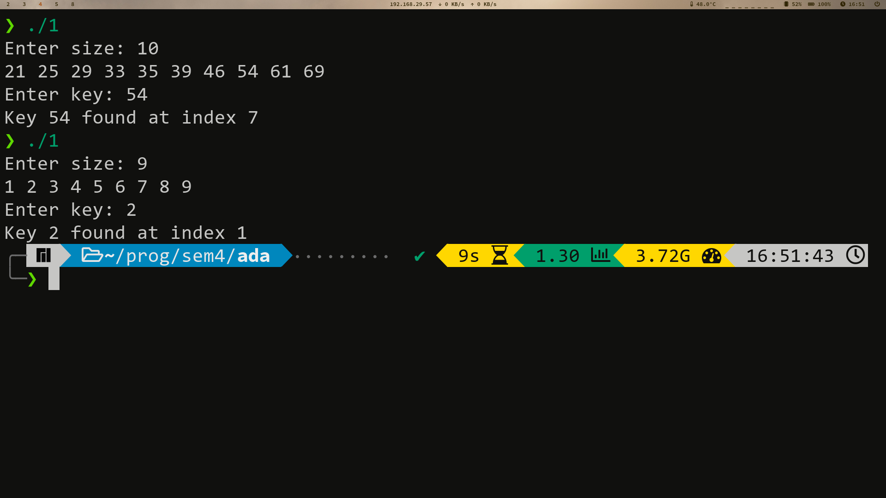
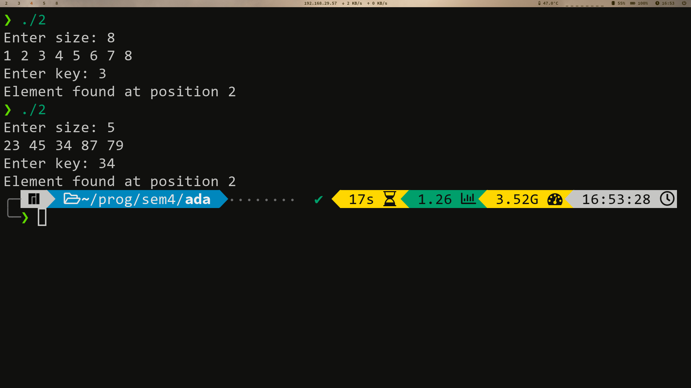
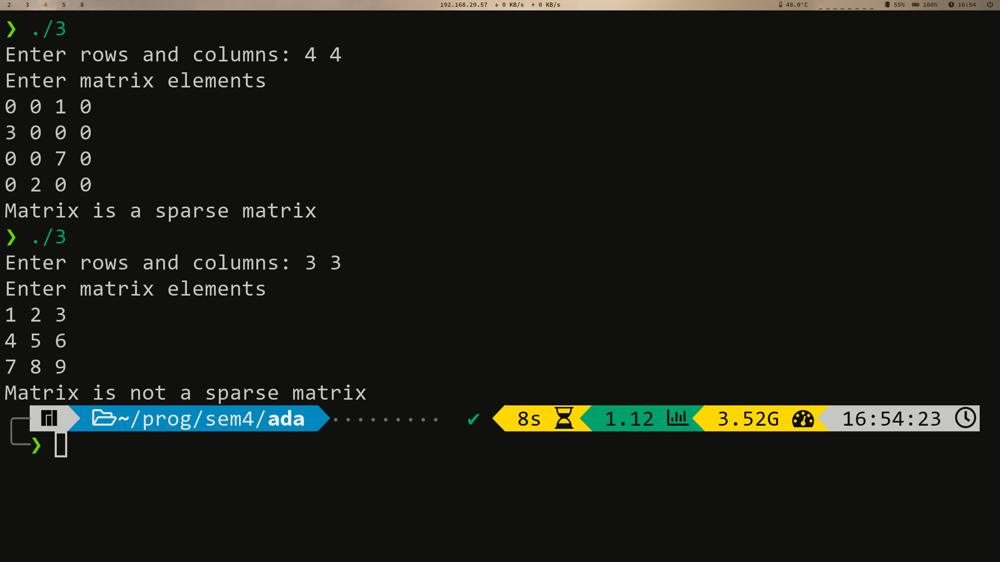
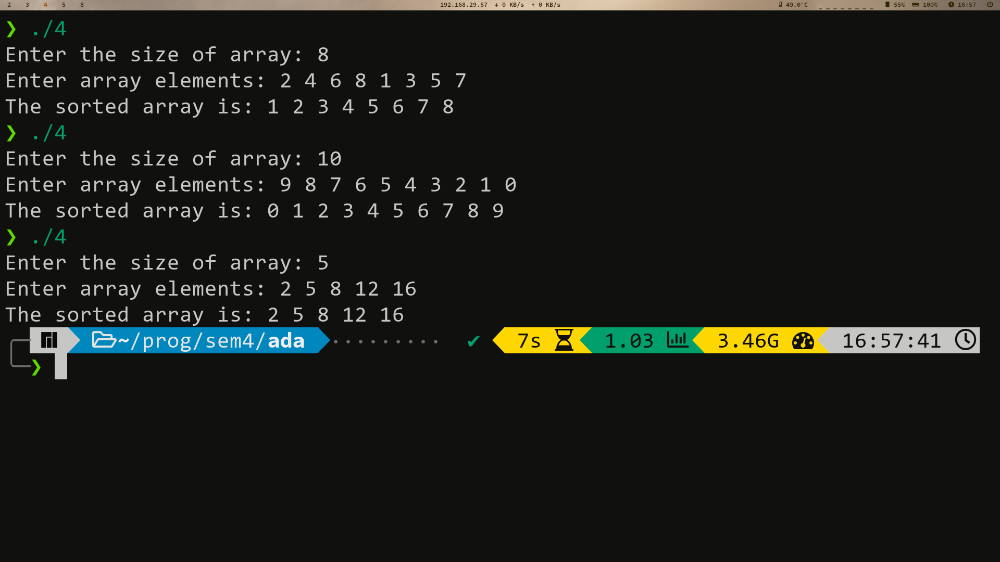

# Table of Contents <!-- omit in toc -->

- [1. Binary & Linear Search](#1-binary--linear-search)
  - [1.1. Binary Search](#11-binary-search)
    - [1.1.1. Source Code](#111-source-code)
    - [1.1.2. Output](#112-output)
  - [1.2. Linear Search](#12-linear-search)
    - [1.2.1. Source Code](#121-source-code)
    - [1.2.2. Output](#122-output)
  - [1.3. Complexity](#13-complexity)
- [2. Sparse Matrix](#2-sparse-matrix)
  - [2.1. Source Code](#21-source-code)
  - [2.2. Output](#22-output)
  - [2.3. Complexity](#23-complexity)
- [3. Bubble Sort](#3-bubble-sort)
  - [3.1. Source Code](#31-source-code)
  - [3.2. Output](#32-output)
  - [3.3. Complexity](#33-complexity)

# 1. Binary & Linear Search
Implement Recursive Binary search and Linear search and determine the time taken to search an element.

## 1.1. Binary Search

### 1.1.1. Source Code

```cpp
#include <bits/stdc++.h>
using namespace std;
int binSearch(int arr[], int low, int high, int key)
{
    if (high < low)
        return -1;
    int mid = low + (high - low) / 2;
    
    if (arr[mid] == key)
        return mid;

    else if (arr[mid] > key)
        return binSearch(arr, low, mid - 1, key);
    
    return binSearch(arr, mid + 1, high, key);
}

int main()
{
    int n;
    cout << "Enter size: ";
    cin >> n;

    int arr[n];

    for (int i = 0; i < n; i++)
    {
        cin >> arr[i];
    }

    int key;
    cout << "Enter key: ";
    cin >> key;

    cout << "Key " << key << " found at index " << binSearch(arr, 0, n - 1, key) << "\n";
    return 0;
}

```
### 1.1.2. Output


## 1.2. Linear Search

### 1.2.1. Source Code

```cpp
#include <bits/stdc++.h>

using namespace std;

int search(int arr[], int n, int x)
{
    int i;
    for (i = 0; i < n; i++)
        if (arr[i] == x)
            return i;
    return -1;
}

int main()
{
    cout << "Enter size: ";
    int n, x;
    cin >> n;
    int arr[n];
    for (int i = 0; i < n; i++)
        cin >> arr[i];
        
    cout << "Enter key: ";
    cin >> x;

    int index = search(arr, n, x);
    if (index == -1)
        cout << "Element is not present in the array";
    else
        cout << "Element found at position " << index << '\n';
    return 0;
}
```
### 1.2.2. Output


## 1.3. Complexity
**Time Complexity for Linear Search:**
As the name suggests, we have to search the whole array once to find out whether the number exist in the array or not. 

**Best case Complexity:** *O(1)*, if the value we are searching for is the first element of the array. 

**Worst case Complexity:** *O(n)*, if the value we are searching for is the last element and n is the number of elements in array. 

**Time Complexity for Binary Search:**
For implementing Binary Search Algorithm, we have to sort the array. The Best Sorting technique (QuickSort) would take *O(nlogn)*. After Sorting, we will have to apply the Binary Search Algorithm.

**Best Case Time Complexity:** *O(1)*, if the element is in the middle of the array.

**Worst Case Time Complexity:** *O(logn)*, if the element is at the beginning or the end of the array.

**Total Best Case Time Complexity:** *O(1)+O(nlogn) = O(nlogn)*

**Total Worst Case Time Complexity:** *O(logn)+O(nlogn) = O(nlogn)*

Hence, we can conclude that when the array not sorted, it is better to choose Linear Search.

However, when the array is sorted, It is better to choose Binary Search

---

# 2. Sparse Matrix

Write a program to determine if a given matrix is a sparse matrix? Calculate its time and Space complexity. How it is more efficient than the conventional matrix?

## 2.1. Source Code
```cpp
#include <bits/stdc++.h>
using namespace std;
int main()
{
    int m, n;
    cout << "Enter rows and columns: ";
    cin >> m >> n;
    int nze = 0;

    int mat[m][n];
    cout << "Enter matrix elements" << "\n";
    for (int i = 0; i < m; i++)
    {
        for (int j = 0; j < n; j++)
        {
            cin >> mat[i][j];
        }
    }

    for (int i = 0; i < m; i++)
    {
        for (int j = 0; j < n; j++)
        {
            if (mat[i][j] != 0)
                nze++;
        }
    }

    if (nze < (m * n) / 2)
        cout << "Matrix is a sparse matrix" << "\n";
    else
        cout << "Matrix is not a sparse matrix" << "\n";

    return 0;
}
```

## 2.2. Output


## 2.3. Complexity
**For checking if a matrix is Sparse or not:**

**Time Complexity:** *O(m x n)*, where m is the number of rows and n is the number of columns.
**Space Complexity:** *O(1)*

Sparse Matrix is better than conventional Matrix because:
- We can save storage, as the number of non-zero elements is less and hence save memory.
- We can save computational time by creating an array or linked list representation for traversing only
non-zero elements.

---

# 3. Bubble Sort

What is Bubble Sort? Write algorithm of mention the Time Space complexity of the Algorithm. Also suggest improvements which will improve the best case running time of Algorithm to *O(n)*.

## 3.1. Source Code
```cpp
#include <bits/stdc++.h>
using namespace std;

void bubble(int arr[], int n)
{
    int i, j;
    for (i = 0; i < n - 1; i++)
        for (j = 0; j < n - i - 1; j++)
            if (arr[j] > arr[j + 1])
            {
                int temp = arr[j];
                arr[j] = arr[j + 1];
                arr[j + 1] = temp;
            }
}

int main()
{
    int n;
    cout << "Enter the size of array: ";
    cin >> n;
    int arr[n];
    cout << "Enter array elements: ";
    for (int i = 0; i < n; i++)
        cin >> arr[i];

    bubble(arr, n);

    cout << "The sorted array is: ";
    for (int i = 0; i < n; i++)
        cout << arr[i] << " ";

    cout << "\n";
}
```

## 3.2. Output


## 3.3. Complexity

Bubble Sort is a sorting algorithm that swaps the adjacent elements if they are in wrong order. After each pass the last element in the unsorted part is put in the correct place. 
- **Time Complexity:** *O(N2)* 
- **Space Complexity:** *O(1)* 
  
To optimise bubble sort we break out of the loop when no swap occurs or the array has become sorted This way the best case time complexity becomes *O(N)* when the array is already sorted.

```cpp
void bubble(int arr[], int n)
{
    int i, j;
    bool is_swapped = false;
    for (i = 0; i < n - 1; i++)
    {
        is_swapped = false;
        for (j = 0; j < n - i - 1; j++)
            if (arr[j] > arr[j + 1])
            {
                is_swapped = true;
                int temp = arr[j];
                arr[j] = arr[j + 1];
                arr[j + 1] = temp;
            }
        if (is_swapped == false)
            break;
    }
}
```