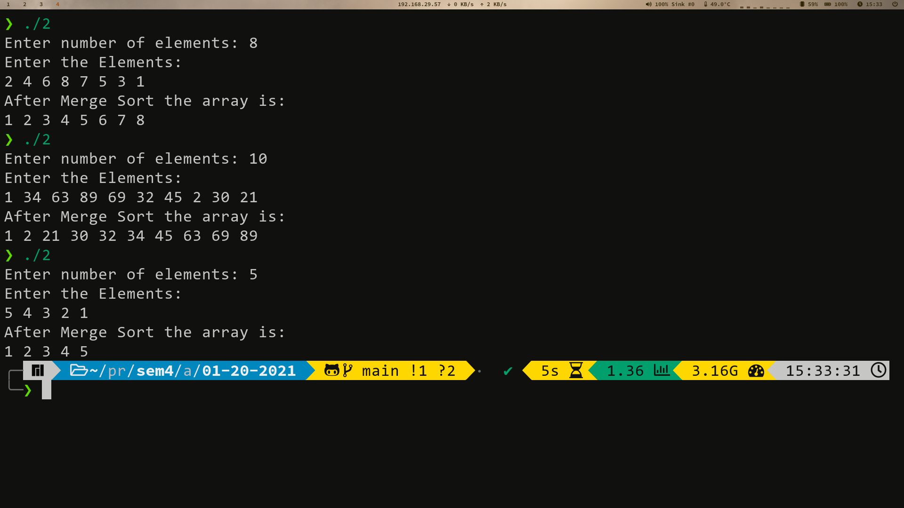

# Table of Contents <!-- omit in toc -->

- [1. Quick Sort](#1-quick-sort)
  - [1.1. Procedure](#11-procedure)
  - [1.2. Efficiency Analysis](#12-efficiency-analysis)
    - [1.2.1. Complexity](#121-complexity)
    - [1.2.2. Advantages:](#122-advantages)
    - [1.2.3. Disadvantages:](#123-disadvantages)
  - [1.3. Source Code](#13-source-code)
  - [1.4. Output](#14-output)
- [2. Merge Sort](#2-merge-sort)
  - [2.1. Procedure](#21-procedure)
  - [2.2. Efficiency Analysis](#22-efficiency-analysis)
    - [2.2.1. Complexity](#221-complexity)
    - [2.2.2. Advantages](#222-advantages)
    - [2.2.3. Disadvantages](#223-disadvantages)
  - [2.3. Source Code](#23-source-code)
  - [2.4. Output](#24-output)

# 1. Quick Sort
Quicksort is a very efficient sorting method. It is also called “partition Exchange Sort”. The strategy used here is “Divide and Conquer” i.e, we successively partition the list into smaller lists and apply the same procedure to the sub-list.

## 1.1. Procedure
We consider one element at a time (pivot) and place it in its correct position. The pivot is placed such that all elements to the left of the pivot are less than the pivot and all elements to the right are greater. 

This partitions the array into two parts-left partition and right partition. The same method is applied for each of the partition. The process continues till no more partition can be made. 

We shall be considering the last element as the pivot element. In quick sort, we do not divide into two equal parts but partition on the basis of the pivot element. 

The function sorts elements a[lb] to a[ub] where lb stands for lower bound and ub stands for the upper bound. 

```cpp
void Quicksort( int a[], int lb,int ub)
{
	int j;
	if(lb<ub)
	{
		j=Partition(a,lb,ub); //partition the array
		Quicksort(a,lb,j-1); //sort first partition
		Quicksort(a,j+1,ub); //sort second partition
	}
}
```

## 1.2. Efficiency Analysis

### 1.2.1. Complexity
- **Best Case Time Complexity:** *O(N logN)*
- **Worst Case Time Complexity:** *O(N$^2$)*
- **Average Case Time Complexity:** *O(N logN)*

### 1.2.2. Advantages: 
- It is a very efficient sorting method. 
- No additional data structure is required. 
- It is in-place sorting method. 

### 1.2.3. Disadvantages: 
- It is not a stable sorting method. 

## 1.3. Source Code
```cpp
#include <bits/stdc++.h>
using namespace std;
void swap(int *x, int *y)
{
    int t = *x;
    *x = *y;
    *y = t;
}
int partition(int *a, int start, int end)
{
    int pivot = a[end], pi = start, i;
    for (i = start; i < end; i++)
    {
        if (a[i] <= pivot)
        {
            swap(a[i], a[pi]);
            pi++;
        }
    }
    swap(a[end], a[pi]);
    return pi;
}

void Quicksort(int *a, int start, int end)
{
    if (start < end)
    {
        int pi = partition(a, start, end);
        Quicksort(a, start, pi - 1);
        Quicksort(a, pi + 1, end);
    }
}
int main()
{
    int n;
    cout << "Enter number of elements: ";
    cin >> n;
    int a[n];
    cout << "Enter the Elements:\n";
    for (int i = 0; i < n; i++)
    {
        cin >> a[i];
    }
    Quicksort(a, 0, n - 1);
    cout << "After Quick Sort the array is:\n";
    for (int i = 0; i < n; i++)
    {
        cout << a[i] << " ";
    }
    cout << '\n';
    return 0;
}
```

## 1.4. Output


---

# 2. Merge Sort
Merge sort is an efficient, general-purpose, comparison-based sorting algorithm. It is a divide and conquer algorithm that was invented by John von Neumann in 1945. Merging is the process of combining two or more sorted data lists into a third list such that it is also sorted.

## 2.1. Procedure
Merge sort is based on the process of merging. It requires two sorted sub-sets to create a sorted set. In Merge sort, the elements to be sorted are divided into two equal parts. Each part is sorted and then merged. To sort each half, the same process is used.

Thus, each part is successively divided into two parts until we reach a point where the sub-part is sorted. This will happen when size=1. Since a list of size 1 is sorted, two adjacent sub-lists can be merged to create a sorted sub-lists. The merging process continues until only one list of size n is obtained. 

```cpp
void MergeSort (int a[], int low, int high)
{
	int mid;
	if(low<high)  //more than one element
	{
		mid=(low + high) / 2; //Divide a into two sublists
		MergeSort (a,low,mid);  //Sort first sub list
		MergeSort (a,mid+1,high); //sort second sub list
		Merge (a,mid,high);  //Merge sorted sub lists
	}
}
```

## 2.2. Efficiency Analysis

### 2.2.1. Complexity
- **Time Complexity:** *O(N logN)*
  
### 2.2.2. Advantages
- Best and worst-case efficiency is *O(N logN)*. Hence it is very efficient.
- It is a stable sorting process.
- It can be parlallelised easily.
  
### 2.2.3. Disadvantages
- Additional memory is required for the merging process. It is not in-place.

## 2.3. Source Code
```cpp
#include <bits/stdc++.h>
using namespace std;

void Merge(int *a, int low, int high, int mid)
{
    int i, j, k, temp[high - low + 1];
    i = low;
    k = 0;
    j = mid + 1;
    while (i <= mid && j <= high)
    {
        if (a[i] < a[j])
        {
            temp[k] = a[i];
            k++;
            i++;
        }
        else
        {
            temp[k] = a[j];
            k++;
            j++;
        }
    }
    while (i <= mid)
    {
        temp[k] = a[i];
        k++;
        i++;
    }
    while (j <= high)
    {
        temp[k] = a[j];
        k++;
        j++;
    }
    for (i = low; i <= high; i++)
    {
        a[i] = temp[i - low];
    }
}

void MergeSort(int *a, int low, int high)
{
    int mid;
    if (low < high)
    {
        mid = (low + high) / 2;
        MergeSort(a, low, mid);
        MergeSort(a, mid + 1, high);
        Merge(a, low, high, mid);
    }
}
int main()
{
    int n;
    cout << "Enter number of elements: ";
    cin >> n;
    int a[n];
    cout << "Enter the Elements:\n";
    for (int i = 0; i < n; i++)
    {
        cin >> a[i];
    }
    MergeSort(a, 0, n - 1);
    cout << "After Merge Sort the array is:\n";
    for (int i = 0; i < n; i++)
    {
        cout << a[i] << " ";
    }
    cout << '\n';
    return 0;
}
```

## 2.4. Output


---