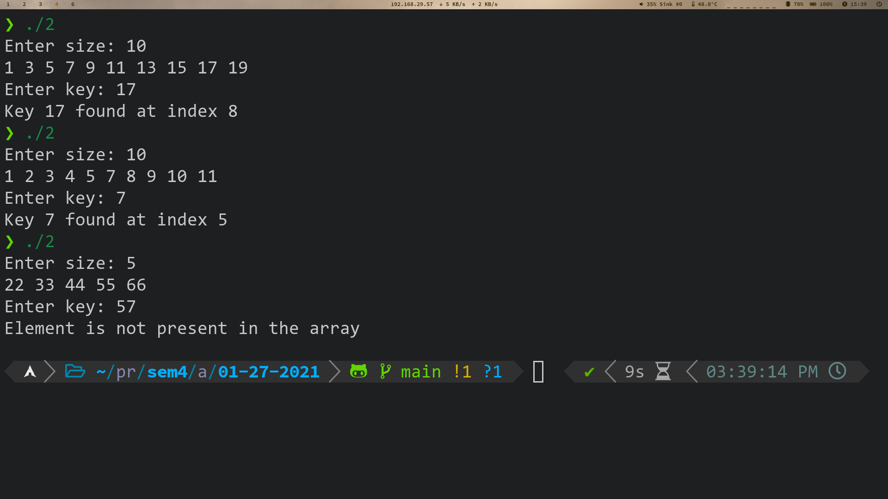

# Table of Contents <!-- omit in toc -->

- [1. Linear Search](#1-linear-search)
  - [1.1. Approach](#11-approach)
  - [1.2. Source Code](#12-source-code)
  - [1.3. Output](#13-output)
  - [1.4. Time Complexity](#14-time-complexity)
- [2. Binary Search](#2-binary-search)
  - [2.1. Approach](#21-approach)
  - [2.2. Source Code](#22-source-code)
  - [2.3. Output](#23-output)
  - [2.4. Time Complexity](#24-time-complexity)
- [3. Fibonacci Search](#3-fibonacci-search)
  - [3.1. Approach](#31-approach)
  - [3.2. Source Code](#32-source-code)
  - [3.3. Output](#33-output)
  - [3.4. Time Complexity](#34-time-complexity)

# 1. Linear Search
A linear search or sequential search sequentially checks each element of the list until a match is found or the whole list has been searched. 

## 1.1. Approach  
- Start from the leftmost element of arr[] and one by one compare x with each element of arr[]
- If x matches with an element, return the index.
- If x doesn’t match with any of elements, return -1.


## 1.2. Source Code

```cpp
#include <bits/stdc++.h>
using namespace std;

int search(int arr[], int size, int key)
{
    int i;
    for (i = 0; i < size; i++)
        if (arr[i] == key)
            return i;
    return -1;
}

int main()
{
    int size;
    cout << "Enter size: ";
    cin >> size;

    int arr[size];
    for (int i = 0; i < size; i++)
    {
        cin >> arr[i];
    }

    int key;
    cout << "Enter key: ";
    cin >> key;
    int index = search(arr, size, key);
    if(index == -1)
        cout << "Element is not present in the array\n";
    else
        cout << "Key " << key << " found at index " << index << "\n";
    return 0;
}
```
## 1.3. Output


## 1.4. Time Complexity  
As the name suggests, we have to search the whole array once to find out whether the number exist in the array or not. 

- **Best case Complexity:** *O(1)*, if the value we are searching for is the first element of the array. 

- **Worst case Complexity:** *O(n)*, if the value we are searching for is the last element and n is the number of elements in array. 


# 2. Binary Search
Binary Search or logarithmic search checks the middle element of a range of elements and divides the range according to the value of the middle element.

## 2.1. Approach  
- Begin with an interval covering the whole array.
- If the value of the search key is less than the item in the middle of the interval, narrow the interval to the lower half.
- Otherwise narrow it to the upper half.
- Repeatedly check until the value is found or the interval is empty.


## 2.2. Source Code

```cpp
#include <bits/stdc++.h>
using namespace std;

int binSearch(int arr[], int low, int high, int key)
{
    if (high < low)
        return -1;
    int mid = low + (high - low) / 2;
    
    if (arr[mid] == key)
        return mid;

    else if (arr[mid] > key)
        return binSearch(arr, low, mid - 1, key);
    
    return binSearch(arr, mid + 1, high, key);
}

int main()
{
    int size;
    cout << "Enter size: ";
    cin >> size;

    int arr[size];
    for (int i = 0; i < size; i++)
    {
        cin >> arr[i];
    }

    int key;
    cout << "Enter key: ";
    cin >> key;
    int found = binSearch(arr, 0, size - 1, key);
    if(found == -1)
        cout << "Element is not present in the array\n";
    else
        cout << "Key " << key << " found at index " << found << "\n";
    return 0;
}
```
## 2.3. Output


## 2.4. Time Complexity  
For implementing Binary Search Algorithm, we have to sort the array. The Best Sorting technique (QuickSort) would take *O(nlogn)*. After Sorting, we will have to apply the Binary Search Algorithm.

- **Best Case Time Complexity:** *O(1)*, if the element is in the middle of the array.

- **Worst Case Time Complexity:** *O(logn)*, if the element is at the beginning or the end of the array.

When the array not sorted, it is better to choose Linear Search.  

However, when the array is sorted, It is better to choose Binary Search.  

---

# 3. Fibonacci Search


## 3.1. Approach
Let arr[0..n-1] be the input array and element to be searched be x.

- Find the smallest Fibonacci Number greater than or equal to n. Let this number be fib_next. Let the two Fibonacci numbers preceding it be fibo2 and fibo1.
- While the array has elements to be inspected:
  - Compare x with the last element of the range covered by fibo1
  - If x matches, return index
  - Else If x is less than the element, move the three Fibonacci variables two Fibonacci down.
  - Else x is greater than the element, move the three Fibonacci variables one Fibonacci down. Reset offset to index.  

- Since there might be a single element remaining for comparison, check if fibo2 is 1. If Yes, compare x with that remaining element. If match, return index.

## 3.2. Source Code
```cpp
#include <bits/stdc++.h>
using namespace std;

int fibonacciSearch(int arr[], int size, int key)
{
    int fibo1 = 0, fibo2 = 1, offset = -1;
    int fib_next = fibo1 + fibo2;

    while (fib_next < size)
    {
        fibo1 = fibo2;
        fibo2 = fib_next;
        fib_next = fibo1 + fibo2;
    }

    while (fib_next > 1)
    {
        int i = min(offset + fibo1, size - 1);

        if (arr[i] < key)
        {
            fib_next = fibo2;
            fibo2 = fibo1;
            fibo1 = fib_next - fibo2;
            offset = i;
        }

        else if (arr[i] > key)
        {
            fib_next = fibo1;
            fibo2 = fibo2 - fibo1;
            fibo1 = fib_next - fibo2;
        }
        else
            return i;
    }

    if (fibo2 && arr[offset + 1] == key)
        return offset + 1;

    return -1;
}

int main()
{
    int size;
    cout << "Enter size: ";
    cin >> size;

    int arr[size];
    for (int i = 0; i < size; i++)
    {
        cin >> arr[i];
    }
    int key;
    cout << "Enter key: ";
    cin >> key;
    int index = fibonacciSearch(arr, size, key);
    if(index == -1)
        cout << "Element is not present in the array\n";
    else
        cout << "Key " << key << " found at index " << index << "\n";
    return 0;
}
```

## 3.3. Output


## 3.4. Time Complexity
The worst case will occur when we have our target in the larger (2/3) fraction of the array, as we proceed to find it, ie when we are eliminating the smaller (1/3) fraction of the array every time. We call once for n, then for(2/3) n, then for (4/9) n and henceforth. Thus we need *O(log N)* time.  
$$ fib(n) = \left[ \frac{1}{\sqrt{5}} \left(\frac{1 + \sqrt{5}}{2} \right)^{n} \right]$$  
<!--  -->
- **Worst case Time Complexity:** *O(log N)*
- **Average case Time Complexity:** *O(log N)*
- **Best case Time Complexity:** *O(1)*

---
