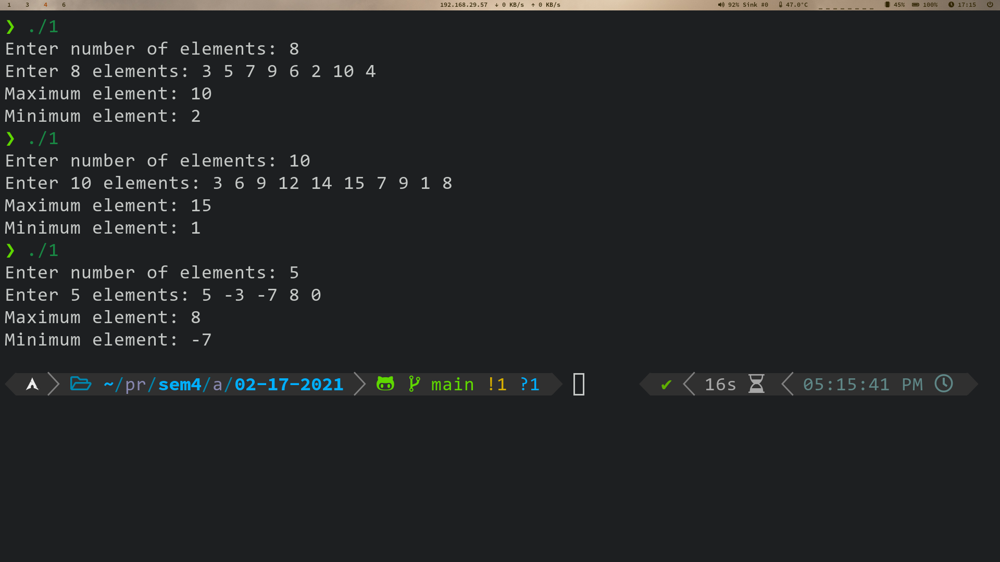
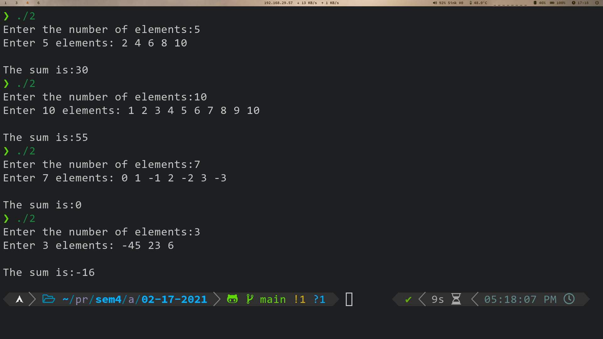
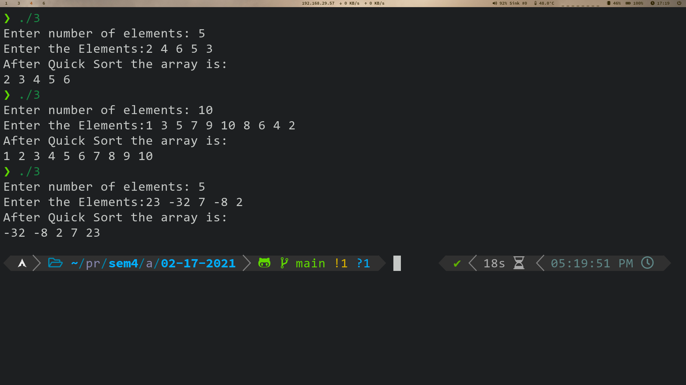

# 1. Max Min Value
Finding the maximum and minimum value in an array using the divide and conquer approach.

## 1.1. Source Code
```cpp
#include <bits/stdc++.h>

using namespace std;

void minmax(int arr[], int low, int high, int &mn, int &mx)
{
    if (low == high)
    {
        if (mx < arr[low])
            mx = arr[low];
        if (mn > arr[high])
            mn = arr[high];
        return;
    }
    if (high - low == 1)
    {
        if (arr[low] < arr[high])
        {
            if (mn > arr[low])
                mn = arr[low];
            if (mx < arr[high])
                mx = arr[high];
        }
        else
        {
            if (mn > arr[high])
                mn = arr[high];
            if (mx < arr[low])
                mx = arr[low];
        }
        return;
    }
    int mid = (low + high) / 2;
    minmax(arr, low, mid, mn, mx);
    minmax(arr, mid + 1, high, mn, mx);
}

int main()
{
    int n, mn = INT_MAX, mx = INT_MIN;
    cout << "Enter number of elements: ";
    cin >> n;
    int arr[n];
    cout << "Enter " << n << " elements: ";
    for (int i = 0; i < n; i++)
        cin >> arr[i];
    minmax(arr, 0, n - 1, mn, mx);
    cout << "Maximum element: " << mx << '\n';
    cout << "Minimum element: " << mn << '\n';
    return 0;
}
```

## 1.2. Output


---

\newpage 

# 2. Array Sum
Computes the sum of an array of integers using the divide and conquer approach.

## 2.1. Source Code
```cpp
#include <bits/stdc++.h>
using namespace std;

int sumArray(int A[], int l, int r)
{
    if (l > r)
        return 0;
    else if (l == r)
        return A[l];
    int mid = (l + r) / 2;
    int lsum = sumArray(A, l, mid);
    int rsum = sumArray(A, mid + 1, r);
    return lsum + rsum;
}

int main()
{
    int n;
    cout << "Enter the number of elements:";
    cin >> n;
    int arr[n];
    cout << "Enter " << n << " elements: ";
    for (int i = 0; i < n; ++i)
        cin >> arr[i];
    cout << "\nThe sum is:" << sumArray(arr, 0, n - 1) << '\n';
    return 0;
}
```

## 2.2. Output


---

\newpage

# 3. Recursive Quick Sort
What is a recursive Quick Sort? Write an algorithm and analyze the Time complexity of the Algorithm.

## 3.1. Definition
Quicksort is a very efficient sorting method. It is also called “partition Exchange Sort”. The strategy used here is “Divide and Conquer” i.e, we successively partition the list into smaller lists and apply the same procedure to the sub-list. 

## 3.2. Source Code
```cpp
#include <bits/stdc++.h>
using namespace std;
void swap(int *x, int *y)
{
    int t = *x;
    *x = *y;
    *y = t;
}
int partition(int *a, int start, int end)
{
    int pivot = a[end], pi = start, i;
    for (i = start; i < end; i++)
    {
        if (a[i] <= pivot)
        {
            swap(a[i], a[pi]);
            pi++;
        }
    }
    swap(a[end], a[pi]);
    return pi;
}

void Quicksort(int *a, int start, int end)
{
    if (start < end)
    {
        int pi = partition(a, start, end);
        Quicksort(a, start, pi - 1);
        Quicksort(a, pi + 1, end);
    }
}
int main()
{
    int n;
    cout << "Enter number of elements: ";
    cin >> n;
    int a[n];
    cout << "Enter the Elements:";
    for (int i = 0; i < n; i++)
    {
        cin >> a[i];
    }
    Quicksort(a, 0, n - 1);
    cout << "After Quick Sort the array is:\n";
    for (int i = 0; i < n; i++)
    {
        cout << a[i] << " ";
    }
    cout << '\n';
    return 0;
}
 ```

## 3.3. Output


## 3.4. Time Complexity
- **Best Case Time Complexity:** *O(N logN)*  
In the best case analysis, the pivot is always chosen as the middle element.
- **Worst Case Time Complexity:** *O(N$^2$)*  
In the worst case analysis, the pivot chosen by the partition process is always greatest or the smallest element.
- **Average Case Time Complexity:** *O(N logN)*  
  
---