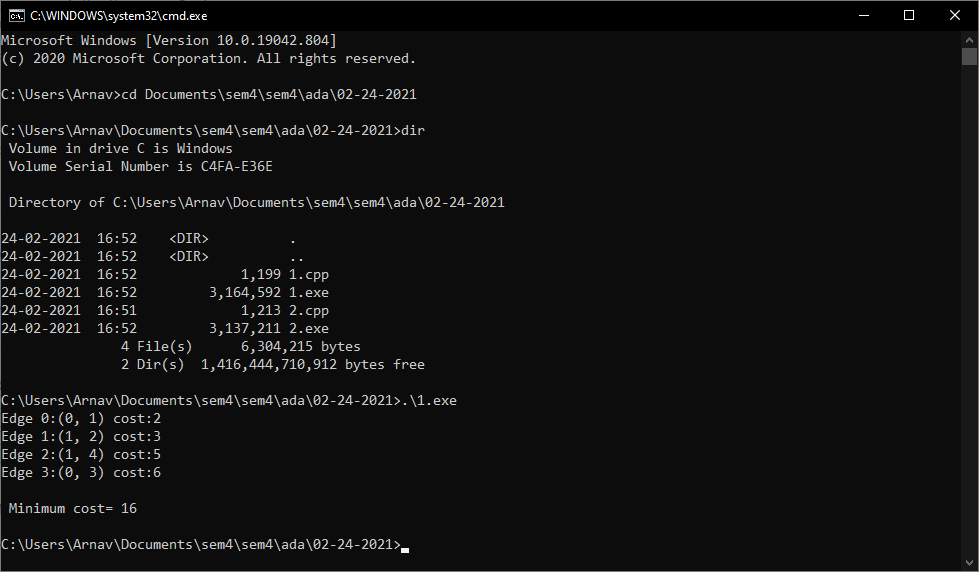
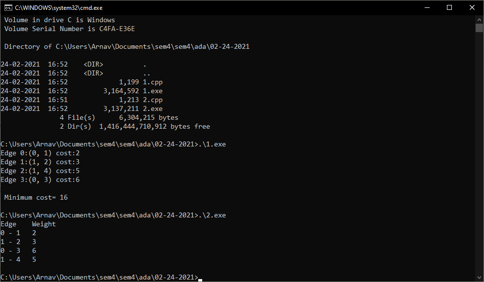

# 1. Kruskal's Minimum Spanning Tree

Implement Kruskal's Minimum Spanning Tree

## 1.1 Source Code
```cpp
#include <bits/stdc++.h>
using namespace std;

#define V 5
int parent[V];

int find(int i)
{
	while (parent[i] != i)
		i = parent[i];
	return i;
}

void uni(int i, int j)
{
	int a = find(i);
	int b = find(j);
	parent[a] = b;
}

void kruskalMST(int cost[][V])
{
	int mincost = 0;


	for (int i = 0; i < V; i++)
		parent[i] = i;

	int edge_count = 0;
	while (edge_count < V - 1)
	{
		int min = INT_MAX, a = -1, b = -1;
		for (int i = 0; i < V; i++)
		{
			for (int j = 0; j < V; j++)
			{
				if (find(i) != find(j) && cost[i][j] < min)
				{
					min = cost[i][j];
					a = i;
					b = j;
				}
			}
		}

		uni(a, b);
		printf("Edge %d:(%d, %d) cost:%d \n",
		       edge_count++, a, b, min);
		mincost += min;
	}
	printf("\nMinimum cost= %d \n", mincost);
}


int main()
{
	/*
	      2    3
	  (0)--(1)--(2)
	   |   / \   |
	  6| 8/   \5 |7
	   | /     \ |
	  (3)-------(4)
	        9          */
	int cost[][V] =
	{
		{ INT_MAX, 2, INT_MAX, 6, INT_MAX },
		{ 2, INT_MAX, 3, 8, 5 },
		{ INT_MAX, 3, INT_MAX, INT_MAX, 7 },
		{ 6, 8, INT_MAX, INT_MAX, 9 },
		{ INT_MAX, 5, 7, 9, INT_MAX },
	};

	kruskalMST(cost);
	return 0;
}
```

## 1.2 Output


## 1.3 Complexity Analysis

**Time Complexity:** *O(V$^2$)*  
As we have to compare all the possible vertex pairs in the matrix, to find the minimum cost edges, the time complexity is *O(V$^2$)*.  
If the graph was implemented as an adjacency list, the complexity would be *O(ElogV)* as we will have to sort the edges and look for minimum cost edges.

---

\newpage

# 2. Prim's Minimum Spanning Tree

Implement Prim's Minimum Spanning Tree

## 2.1 Source Code
```cpp
#include <bits/stdc++.h>
using namespace std;

#define V 5

int minKey(int key[], bool mstSet[])
{
	int min = INT_MAX, min_index;

	for (int v = 0; v < V; v++)
		if (mstSet[v] == false && key[v] < min)
			min = key[v], min_index = v;

	return min_index;
}

void printMST(int parent[], int graph[V][V])
{
	cout<<"Edge \tWeight\n";
	for (int i = 1; i < V; i++)
		cout<<parent[i]<<" - "<<i<<" \t"<<graph[i][parent[i]]<<" \n";
}

void primMST(int graph[V][V])
{
	int parent[V];
	int key[V];
	bool mstSet[V];
	for (int i = 0; i < V; i++)
		key[i] = INT_MAX, mstSet[i] = false;
	key[0] = 0;
	parent[0] = -1;
	for (int count = 0; count < V - 1; count++)
	{
		int u = minKey(key, mstSet);
		mstSet[u] = true;

		for (int v = 0; v < V; v++)
			if (graph[u][v] && mstSet[v] == false && graph[u][v] < key[v])
				parent[v] = u, key[v] = graph[u][v];
	}

	printMST(parent, graph);
}

int main()
{
	/*
	    2    3
	(0)--(1)--(2)
	|    / \   |
	6| 8/   \5 |7
	| /      \ |
	(3)-------(4)
	      9     */
	int graph[V][V] = { { 0, 2, 0, 6, 0 },
		{ 2, 0, 3, 8, 5 },
		{ 0, 3, 0, 0, 7 },
		{ 6, 8, 0, 0, 9 },
		{ 0, 5, 7, 9, 0 }
	};

	primMST(graph);

	return 0;
}
```

## 2.2 Output


## 2.3 Complexity Analysis

 **Time Complexity:** *O(V$^2$)*   
As we have to compare all the possible vertex pairs in the matrix, to find the minimum cost edges, the time complexity is *O(V$^2$)*.  
If the graph was implemented as an adjacency list, the complexity would be *O(ElogV)* as we will have to sort the edges and look for minimum cost edges.

---