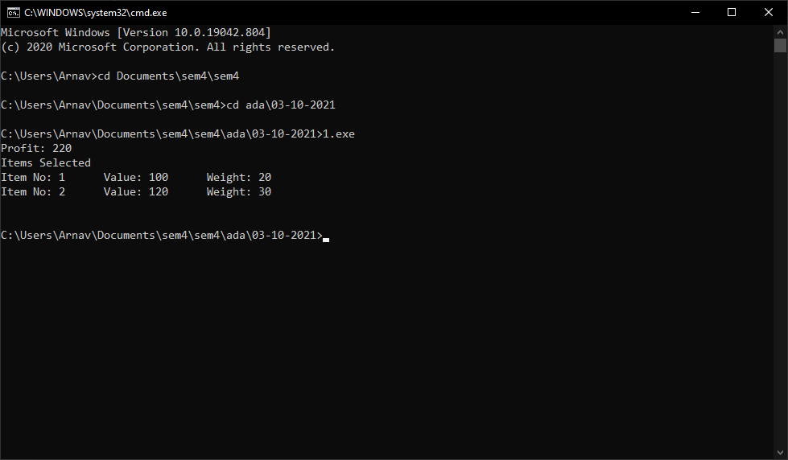

# Knapsack Problem
Write program (in any language) to solve the following problem: Consider two integer arrays `val[0..n-1]` and `wt[0..n-1]` which represent values and weights associated with n items respectively. Also given an integer W which represents knapsack capacity, find out the maximum value subset of `val[]` such that sum of the weights of this subset is smaller than or equal to W. You cannot break an item, either pick the complete item or don’t pick it.  
	`Value[] = {60, 100, 120}`   
	`Weight[] = {10, 20, 30}`   
	`W = 50` 


## Source Code
```cpp
#include <bits/stdc++.h>
using namespace std;

map<pair<int, int>, pair<int, vector<int>>> dp;

pair<int, vector<int>> knapSack(int W, int wt[], int val[], int i)
{
    if (i < 0)
        return {0, vector<int>(0)};
    if (dp[{i, W}].first != 0)
        return dp[{i, W}];

    if (wt[i] > W)
    {
        dp[{i, W}] = knapSack(W, wt, val, i - 1);
        return dp[{i, W}];
    }
    else
    {
        auto a = knapSack(W - wt[i], wt, val, i - 1);
        a.first += val[i];
        a.second.push_back(i);
        auto b = knapSack(W, wt, val, i - 1);
        dp[{i, W}] = a.first > b.first ? a : b;
        return dp[{i, W}];
    }
}

int main()
{
    int val[] = {60, 100, 120};
    int wt[] = {10, 20, 30};
    int W = 50;
    int n = sizeof(val) / sizeof(val[0]);
    auto ans = knapSack(W, wt, val, n);
    cout << "Profit: " << ans.first << '\n';
    cout << "Items Selected\n";
    for (auto x : ans.second)
        cout << "Item No: " << x << "\tValue: " << val[x] << "\tWeight: " << wt[x] << '\n';
    cout << '\n';
    return 0;
}
```

## Output
