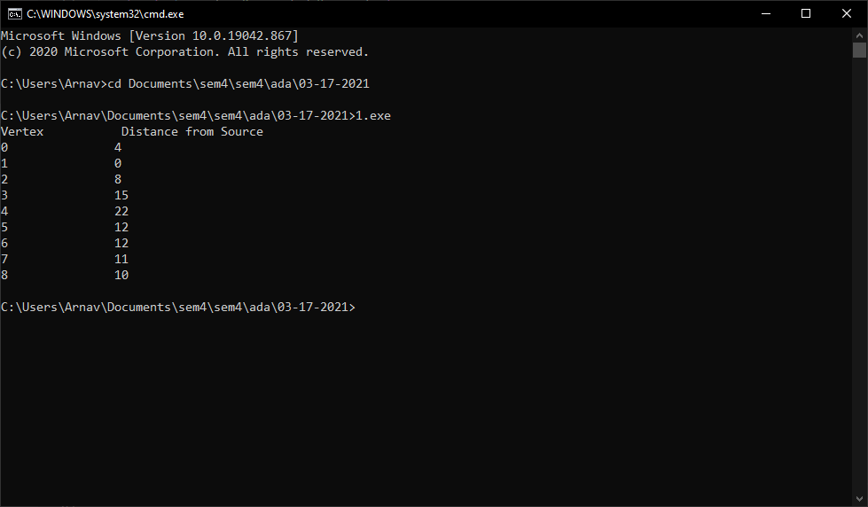

# Dijkstra Algorithm
Write a program to implement Dijkstra’s algorithm. From vertex ‘1’ in a weighted connected graph, find shortest paths to other vertices using Dijkstra’s algorithm
\begin{center}
\begin{tikzpicture}
  
  \node [style={circle, fill=blue!20}, inner sep=3mm] (n0) at (1, 5) {0};
  \node [style={circle, fill=blue!20}, inner sep=3mm] (n1) at (4, 8) {1};
  \node [style={circle, fill=blue!20}, inner sep=3mm] (n2) at (7, 8) {2};
  \node [style={circle, fill=blue!20}, inner sep=3mm] (n3) at (10, 8) {3};
  \node [style={circle, fill=blue!20}, inner sep=3mm] (n4) at (13, 5) {4};
  \node [style={circle, fill=blue!20}, inner sep=3mm] (n5) at (10, 2) {5};
  \node [style={circle, fill=blue!20}, inner sep=3mm] (n6) at (7, 2) {6};
  \node [style={circle, fill=blue!20}, inner sep=3mm] (n7) at (4, 2) {7};
  \node [style={circle, fill=blue!20}, inner sep=3mm] (n8) at (7, 5) {8};
  
%   \node (n6) at (1,10) {6};
%   \node (n4) at (4,8)  {4};
%   \node (n5) at (8,9)  {5};
%   \node (n1) at (11,8) {1};
%   \node (n2) at (9,6)  {2};
%   \node (n3) at (5,5)  {3};
    % \draw (n1) --node [above] {7} (n2);
  \foreach \from/\nu/\to in {n0/4/n1,n1/8/n2,n2/7/n3,n3/9/n4,n4/10/n5,n5/2/n6,n6/1/n7,n0/8/n7,n7/7/n8,n2/4/n5}
    \draw (\from) --node [above] {\nu} (\to);
    
    \foreach \from/\nu/\to in {n1/11/n7, n2/2/n8, n8/6/n6, n3/14/n5}
        \draw (\from) --node [left] {\nu} (\to);

\end{tikzpicture}
\end{center}

## Source Code
```cpp
#include <bits/stdc++.h>

using namespace std;

int minDistance(int dist[], bool sptSet[])
{
    int min = INT_MAX, min_index;

    for (int v = 0; v < 9; v++)
        if (sptSet[v] == false && dist[v] <= min)
            min = dist[v], min_index = v;

    return min_index;
}

void printSolution(int dist[])
{
    cout << "Vertex \t\t Distance from Source\n";
    for (int i = 0; i < 9; i++)
        cout << i << "\t\t" << dist[i] << '\n';
}

void dijkstra(int graph[9][9], int src)
{
    int dist[9];
    bool sptSet[9];
    for (int i = 0; i < 9; i++)
        dist[i] = INT_MAX, sptSet[i] = false;
    dist[src] = 0;
    for (int count = 0; count < 8; count++)
    {
        int u = minDistance(dist, sptSet);
        sptSet[u] = true;

        for (int v = 0; v < 9; v++)
            if (!sptSet[v] && graph[u][v] && dist[u] != INT_MAX && dist[u] + graph[u][v] < dist[v])
                dist[v] = dist[u] + graph[u][v];
    }

    printSolution(dist);
}

int main()
{
    int graph[9][9] = {{0, 4, 0, 0, 0, 0, 0, 8, 0},
                       {4, 0, 8, 0, 0, 0, 0, 11, 0},
                       {0, 8, 0, 7, 0, 4, 0, 0, 2},
                       {0, 0, 7, 0, 9, 14, 0, 0, 0},
                       {0, 0, 0, 9, 0, 10, 0, 0, 0},
                       {0, 0, 4, 14, 10, 0, 2, 0, 0},
                       {0, 0, 0, 0, 0, 2, 0, 1, 6},
                       {8, 11, 0, 0, 0, 0, 1, 0, 7},
                       {0, 0, 2, 0, 0, 0, 6, 7, 0}};

    dijkstra(graph, 1);

    return 0;
}

```

## Output


