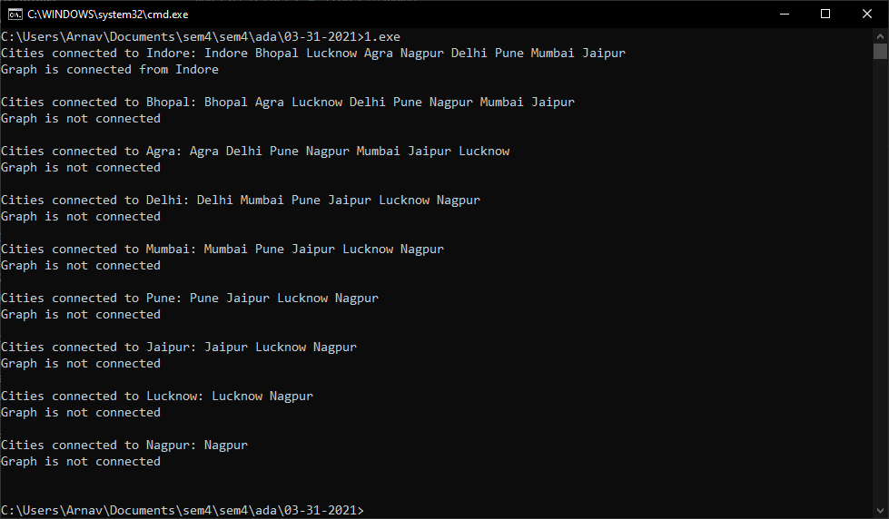

# Graph
Design, develop and implement a program in your preferred language for the following operations
on Graph(G) of Cities  
1. Create a Graph of N cities using Adjacency Matrix.  
2. Print all the nodes reachable from a given starting node in a digraph using BFS  
3. Check whether the graph is connected using DFS  

\includegraphics{graph}

## Source Code
```cpp
#include <bits/stdc++.h>
using namespace std;
#define V 9

class cities
{
public:
    int graph[V][V];
    string cityNames[V];
    bool visited[V];
    cities()
    {
        for (int i = 0; i < V; i++)
        {
            for (int j = 0; j < i; j++)
            {
                graph[i][j] = 0;
            }
            cityNames[0] = "Indore";
            cityNames[1] = "Bhopal";
            cityNames[2] = "Agra";
            cityNames[3] = "Delhi";
            cityNames[4] = "Mumbai";
            cityNames[5] = "Pune";
            cityNames[6] = "Jaipur";
            cityNames[7] = "Lucknow";
            cityNames[8] = "Nagpur";
        }
    }
    void add_edge(int i, int j) { graph[i][j] = 1; }
    void findConnectedCities(int start)
    {
        memset(visited, false, sizeof(visited));
        list<int> q;
        q.push_back(start);
        visited[start] = true;
        cout << "Cities connected to " << cityNames[start] << ": ";
        int vis = 0;
        while (!q.empty())
        {
            vis = q.front();
            cout << cityNames[vis] << " ";
            q.erase(q.begin());
            for (int i = 0; i < V; i++)
            {
                if (graph[vis][i] == 1 && (!visited[i]))
                {
                    q.push_back(i);
                    visited[i] = true;
                }
            }
        }
    }
    void dfs(int start)
    {
        visited[start] = true;
        for (int j = 0; j < V; j++)
        {
            if (graph[start][j] == 1 && (!visited[j]))
            {
                dfs(j);
            }
        }
    }
    void checkConnectedCities(int start)
    {
        memset(visited, false, sizeof(visited));
        dfs(start);
        bool connected = true;
        for (int i = 0; i < V; i++)
        {
            if (!visited[i])
            {
                connected = false;
                break;
            }
        }
        (connected) ? cout << "Graph is connected from " << cityNames[start]
                    : cout << "Graph is not connected";
        cout << "\n";
    }
} g;

int main()
{
    g.add_edge(0, 1);
    g.add_edge(0, 7);
    g.add_edge(1, 7);
    g.add_edge(1, 2);
    g.add_edge(2, 8);
    g.add_edge(2, 3);
    g.add_edge(2, 5);
    g.add_edge(3, 4);
    g.add_edge(3, 5);
    g.add_edge(4, 5);
    g.add_edge(5, 6);
    g.add_edge(6, 7);
    g.add_edge(6, 8);
    g.add_edge(7, 8);
    for (int i = 0; i < V; i++)
    {
        g.findConnectedCities(i);
        cout << "\n";
        g.checkConnectedCities(i);
        cout << "\n";
    }
    return 0;
}
```

## Output
