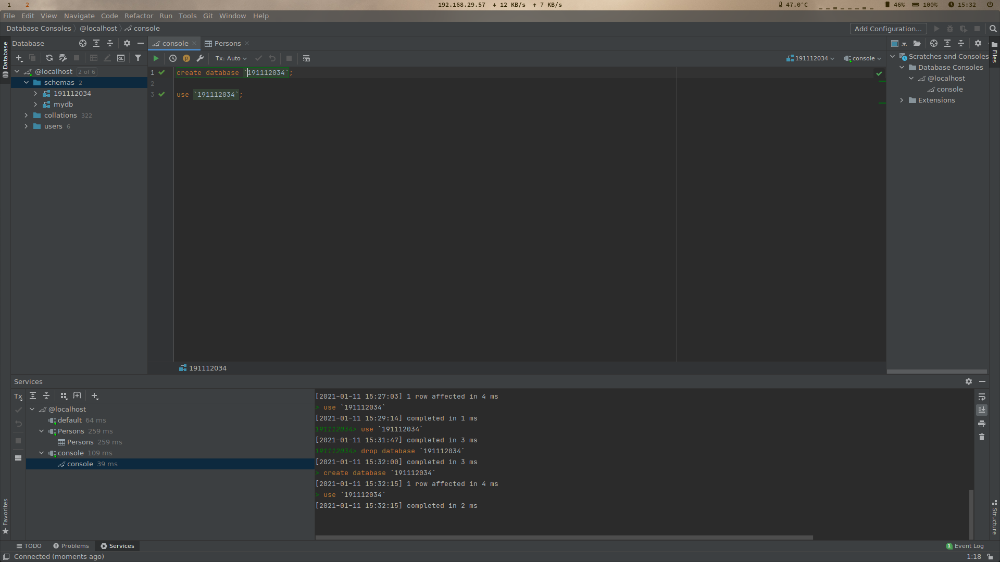
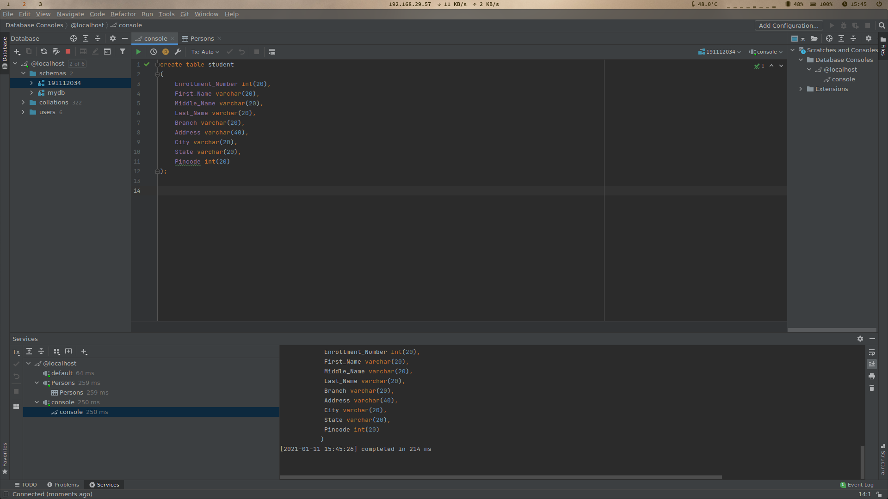
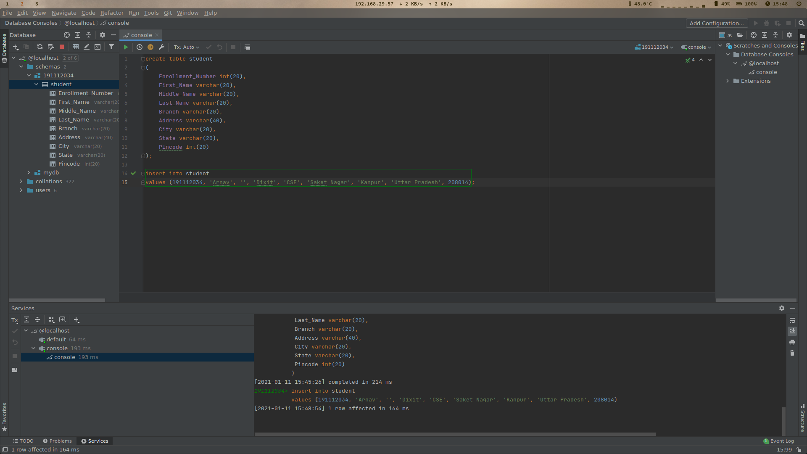
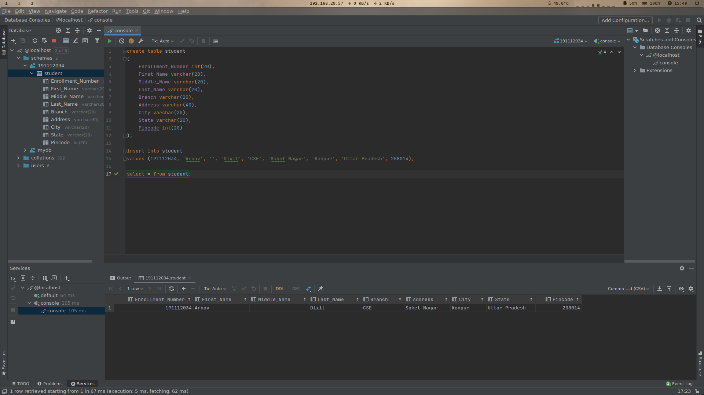

- [1. Create Schema](#1-create-schema)
  - [1.1. Code](#11-code)
  - [1.2. Output](#12-output)
- [2. Create Table](#2-create-table)
  - [2.1. Code](#21-code)
  - [2.2. Output](#22-output)
- [3. Insert Values](#3-insert-values)
  - [3.1. Code](#31-code)
  - [3.2. Output](#32-output)
- [4. Display Values](#4-display-values)
  - [4.1. Code](#41-code)
  - [4.2. Output](#42-output)


# 1. Create Schema
Create a database with your Scholar Number.

## 1.1. Code
```sql
    create database `191112034`;
```
## 1.2. Output


---

# 2. Create Table
Create a table student with following attributes:

|Field             |Data Type|Size|
|------------------|---------|---:|
|Enrollment_Number | int     | 20 |
|First_name        | varchar | 20 |
|Middle_name       | varchar | 20 |
|Last_name         | varchar | 20 |
|Branch            | varchar | 20 |
|Address           | varchar | 40 |
|City              | varchar | 20 |
|State             | varchar | 20 |
|Pincode           | int     | 20 |

## 2.1. Code
```sql
    create table student (
        Enrollment_Number int(20),
        First_name varchar(20),
        Middle_name varchar(20),
        Last_name varchar(20),
        Branch varchar(20),
        Address varchar(40),
        City varchar(20),
        State varchar(20),
        Pincode int(20)
    );
```
## 2.2. Output


---

# 3. Insert Values
Insert values into the table just created.

## 3.1. Code
```sql
    insert into student values (
        191112034,
        'Arnav',
        '',
        'Dixit',
        'CSE',
        'Saket Nagar',
        'Kanpur',
        'Uttar Pradesh',
        208014
    );
```
## 3.2. Output


---

# 4. Display Values
Display the table.

## 4.1. Code
```sql
    select * from student;
```
## 4.2. Output


