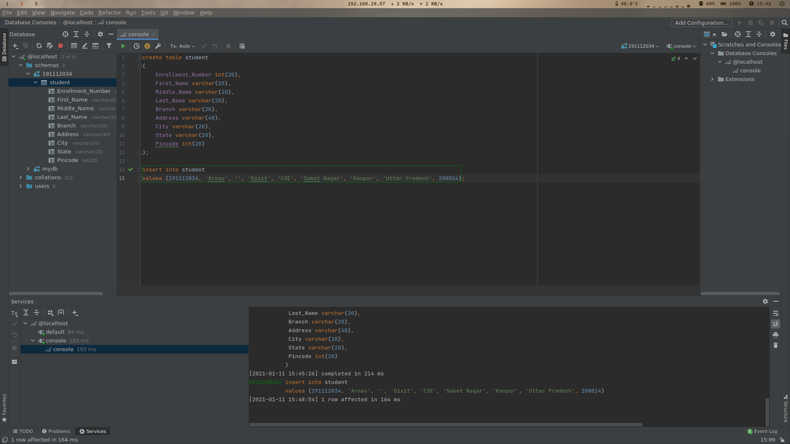

# Table of Contents

1.  [Create Schema](#org56e5f71)
2.  [Create Table](#org8bd2f01)
3.  [Insert Values](#orgd9a3b3d)
4.  [Display Values](#org53c6e48)


<a id="org56e5f71"></a>

# Create Schema
```sql
    create database `191112034`;
```


<a id="org8bd2f01"></a>

# Create Table
```sql
    create table student (
        Enrollment_Number int(20),
        First_name varchar(20),
        Middle_name varchar(20),
        Last_name varchar(20),
        Branch varchar(20),
        Address varchar(40),
        City varchar(20),
        State varchar(20),
        Pincode int(20)
    );
```


<a id="orgd9a3b3d"></a>

# Insert Values
```sql
    insert into student values (
        191112034,
        'Arnav',
        '',
        'Dixit',
        'CSE',
        'Saket Nagar',
        'Kanpur',
        'Uttar Pradesh',
        208014
    );
```



<a id="org53c6e48"></a>

# Display Values
```sql
    select * from student;
```


