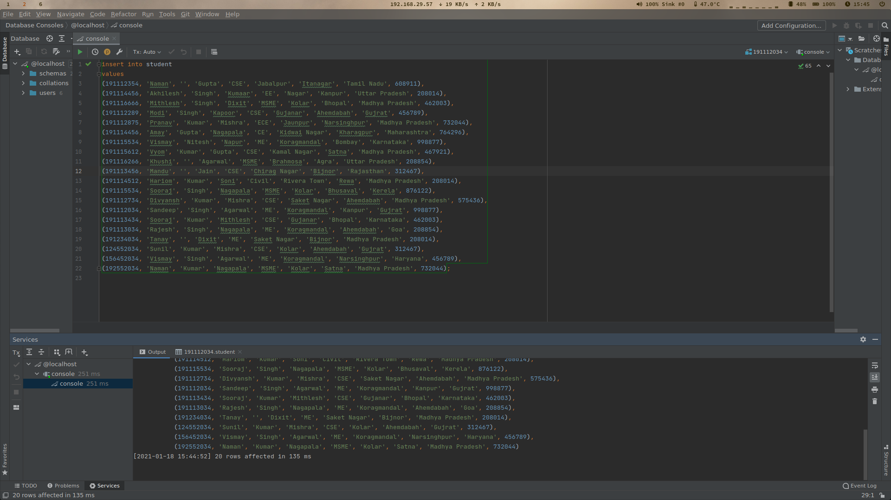
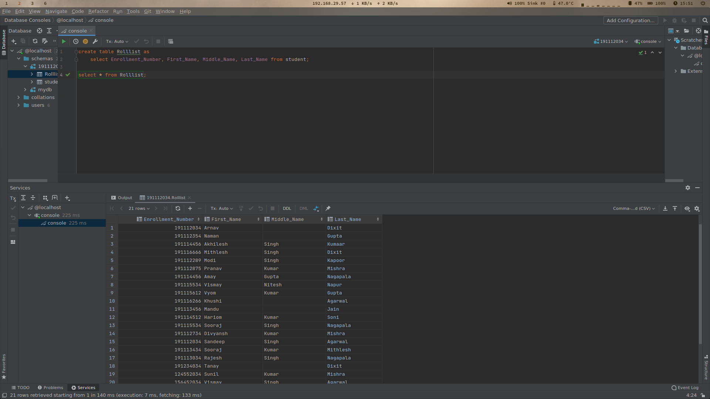
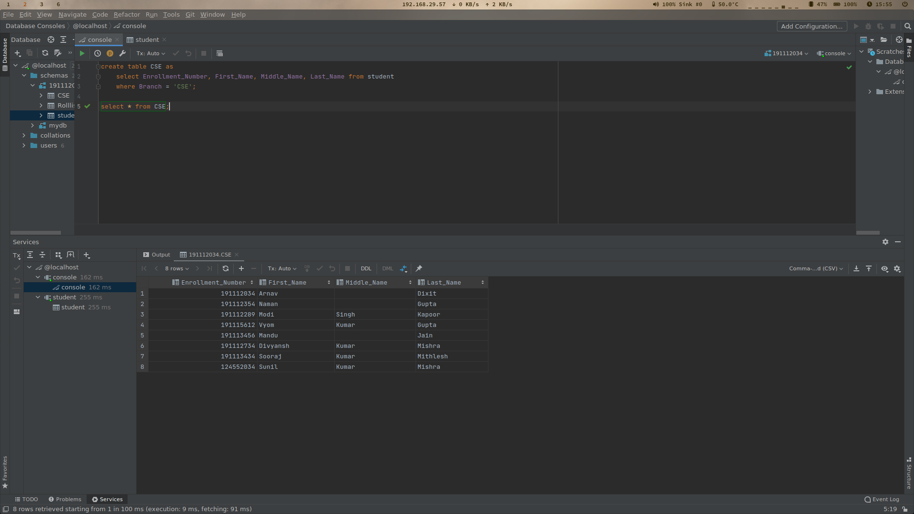
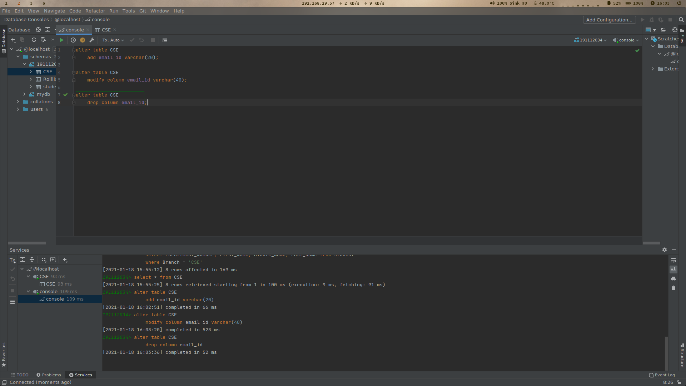
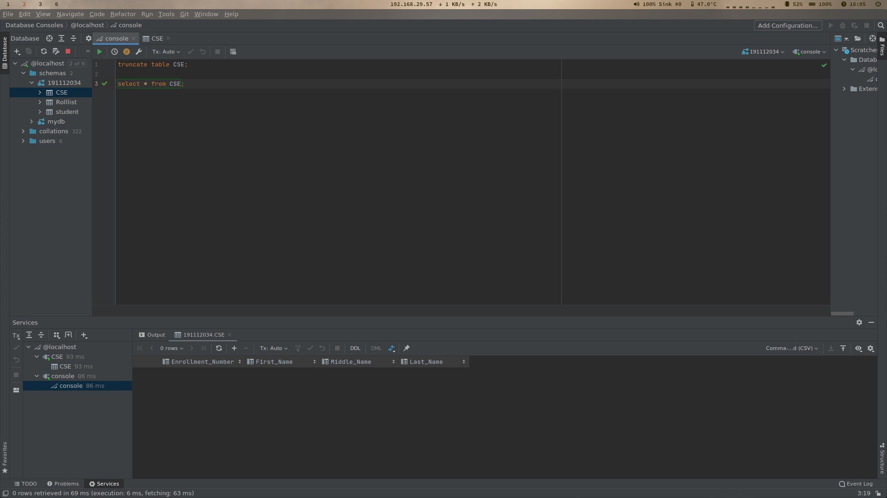
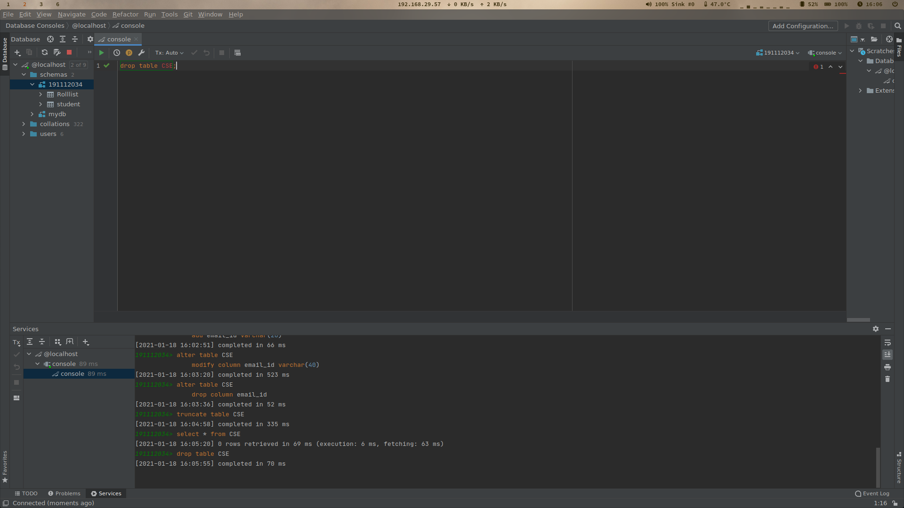

# Table of Contents <!-- omit in toc -->

- [1. Insert Records](#1-insert-records)
  - [1.1. Source Code](#11-source-code)
  - [1.2. Output](#12-output)
- [2. Create Table from Existing Table](#2-create-table-from-existing-table)
  - [2.1. Source Code](#21-source-code)
  - [2.2. Output](#22-output)
- [3. Create Table with WHERE clause](#3-create-table-with-where-clause)
  - [3.1. Source Code](#31-source-code)
  - [3.2. Output](#32-output)
- [4. Alter Table](#4-alter-table)
  - [4.1. Source Code](#41-source-code)
  - [4.2. Output](#42-output)
- [5. Delete Records](#5-delete-records)
  - [5.1. Source Code](#51-source-code)
  - [5.2. Output](#52-output)
- [6. Delete Table](#6-delete-table)
  - [6.1. Source Code](#61-source-code)
  - [6.2. Output](#62-output)

# 1. Insert Records
Insert approximate 20 records of distinct students of different (CSE, EC, ME and CE) branch and city (Bhopal, Jabalpur, Indore, Delhi and etc), address, state (accordingly)and pin code (accordingly).

## 1.1. Source Code
```sql
insert into student
values
(191112354, 'Naman', '', 'Gupta', 'CSE', 'Jabalpur', 'Itanagar', 'Tamil Nadu', 608911),
(191114456, 'Akhilesh', 'Singh', 'Kumaar', 'EE', 'Nagar', 'Kanpur', 'Uttar Pradesh', 208014),
(191116666, 'Mithlesh', 'Singh', 'Dixit', 'MSME', 'Kolar', 'Bhopal', 'Madhya Pradesh', 462003),
(191112289, 'Modi', 'Singh', 'Kapoor', 'CSE', 'Gujanar', 'Ahemdabah', 'Gujrat', 456789),
(191112875, 'Pranav', 'Kumar', 'Mishra', 'ECE', 'Jaunpur', 'Narsinghpur', 'Madhya Pradesh', 732044),
(191114456, 'Amay', 'Gupta', 'Nagapala', 'CE', 'Kidwai Nagar', 'Kharagpur', 'Maharashtra', 764296),
(191115534, 'Vismay', 'Nitesh', 'Napur', 'ME', 'Koragmandal', 'Bombay', 'Karnataka', 998877),
(191115612, 'Vyom', 'Kumar', 'Gupta', 'CSE', 'Kamal Nagar', 'Satna', 'Madhya Pradesh', 467921),
(191116266, 'Khushi', '', 'Agarwal', 'MSME', 'Brahmosa', 'Agra', 'Uttar Pradesh', 208854),
(191113456, 'Mandu', '', 'Jain', 'CSE', 'Chirag Nagar', 'Bijnor', 'Rajasthan', 312467),
(191114512, 'Hariom', 'Kumar', 'Soni', 'Civil', 'Rivera Town', 'Rewa', 'Madhya Pradesh', 208014),
(191115534, 'Sooraj', 'Singh', 'Nagapala', 'MSME', 'Kolar', 'Bhusaval', 'Kerela', 876122),
(191112734, 'Divyansh', 'Kumar', 'Mishra', 'CSE', 'Saket Nagar', 'Ahemdabah', 'Madhya Pradesh', 575436),
(191112034, 'Sandeep', 'Singh', 'Agarwal', 'ME', 'Koragmandal', 'Kanpur', 'Gujrat', 998877),
(191113434, 'Sooraj', 'Kumar', 'Mithlesh', 'CSE', 'Gujanar', 'Bhopal', 'Karnataka', 462003),
(191113034, 'Rajesh', 'Singh', 'Nagapala', 'ME', 'Koragmandal', 'Ahemdabah', 'Goa', 208854),
(191234034, 'Tanay', '', 'Dixit', 'ME', 'Saket Nagar', 'Bijnor', 'Madhya Pradesh', 208014),
(124552034, 'Sunil', 'Kumar', 'Mishra', 'CSE', 'Kolar', 'Ahemdabah', 'Gujrat', 312467),
(156452034, 'Vismay', 'Singh', 'Agarwal', 'ME', 'Koragmandal', 'Narsinghpur', 'Haryana', 456789),
(192552034, 'Naman', 'Kumar', 'Nagapala', 'MSME', 'Kolar', 'Satna', 'Madhya Pradesh', 732044);
```
## 1.2. Output


---

# 2. Create Table from Existing Table
Create one table as ‘Rolllist’ with reference of student class.

|Field             |Data Type|Size|
|------------------|---------|---:|
|Enrollment_Number | int     | 20 |
|First_name        | varchar | 20 |
|Middle_name       | varchar | 20 |
|Last_name         | varchar | 20 |

## 2.1. Source Code
```sql
create table Rolllist as
    select Enrollment_Number, First_Name, Middle_Name, Last_Name from student;

select * from Rolllist;
```

## 2.2. Output


---

# 3. Create Table with WHERE clause
Create one table as ‘CSE’ with reference of student class having record of all student of CSE branch as 

|Field             |Data Type|Size|
|------------------|---------|---:|
|Enrollment_Number | int     | 20 |
|First_name        | varchar | 20 |
|Middle_name       | varchar | 20 |
|Last_name         | varchar | 20 |

## 3.1. Source Code
```sql
create table CSE as
    select Enrollment_Number, First_Name, Middle_Name, Last_Name from student
    where Branch = 'CSE';

select * from CSE;
```

## 3.2. Output


---

# 4. Alter Table
Alter table ‘CSE’ to: 
- To add email-id as attributes   
- To modify email-id datatype  
- Drop the attribute email-id 

## 4.1. Source Code
```sql
alter table CSE
    add email_id varchar(20);

alter table CSE
    modify column email_id varchar(40);

alter table CSE
    drop column email_id;
```

## 4.2. Output


---

# 5. Delete Records
Delete all the record of table ‘CSE’

## 5.1. Source Code
```sql
truncate table CSE;

select * from CSE;
```

## 5.2. Output


---

# 6. Delete Table
Delete the structure of whole table ‘CSE’ 

## 6.1. Source Code
```sql
drop table CSE;
```

## 6.2. Output


---