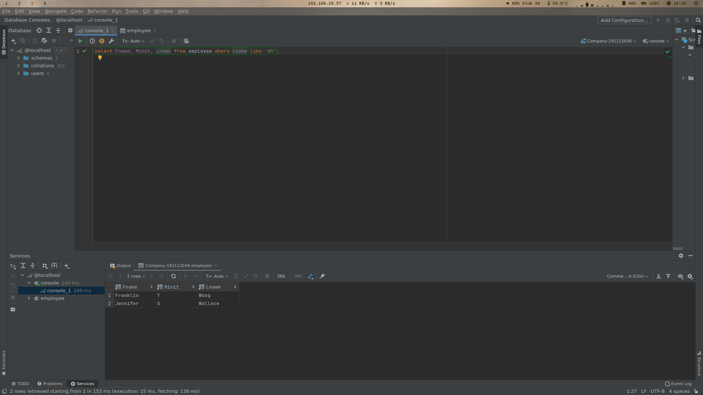
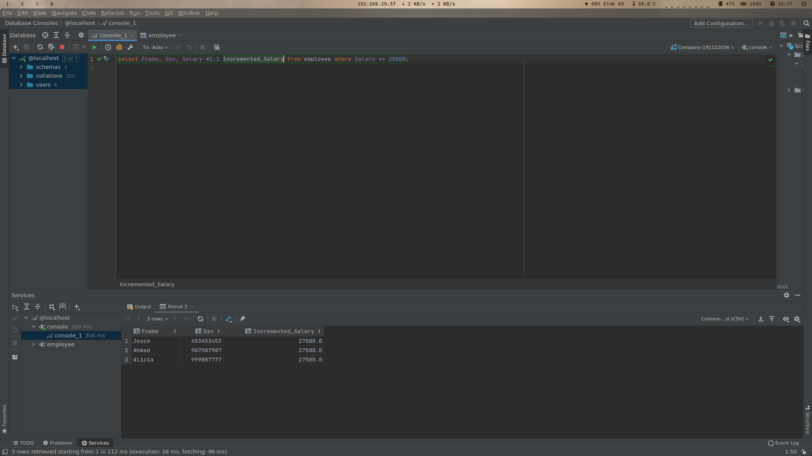
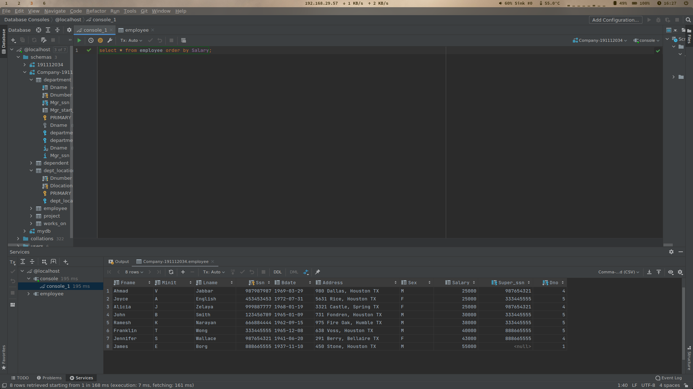
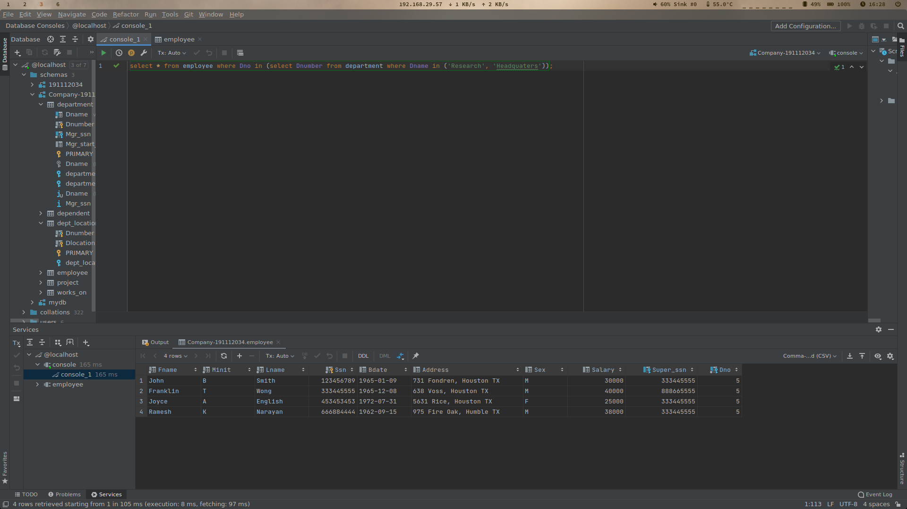

\newpage

# 1. Query 1
Get the name of employees who earn a salary of more than 30000$. 

## 1.1. Source Code
```sql
select Fname, Minit, Lname from employee 
    where Salary > 30000;
```

## 1.2. Output


---

\newpage

# 2. Query 2 
Get the name of the employee whose last name begins with ‘W’ 

## 2.1. Source Code
```sql
select Fname, Minit, Lname from employee 
    where Lname like 'W%';
```

## 2.2. Output


---

\newpage

# 3. Query 3
If the Company wants to give increment to those employees who earn less than or equal to 25000$ by 10%, then get the incremented amount of salary. 

## 3.1. Source Code
```sql
select Fname, Ssn, Salary *1.1 Incremented_Salary from employee 
    where Salary <= 25000;
```

## 3.2. Output


---

\newpage

# 4. Query 4 
Get the department number whose belongs to a location that name end with ‘D’ 

## 4.1. Source Code
```sql
select Dnumber from dept_locations 
    where Dlocation like '%D';
```

## 4.2. Output


---

\newpage

# 5. Query 5
Get the detail of employee in sorted form according to their salary in increasing order. 

## 5.1. Source Code
```sql
select * from employee order by Salary;
```

## 5.2. Output


---

\newpage

# 6. Query 6
Get the details of employee who works in the headquarters or research department. (By using IN clause)  

## 6.1. Source Code
```sql
select * from employee 
    where Dno in (select Dnumber from department 
        where Dname in ('Research', 'Headquaters'));
```

## 6.2. Output


---
