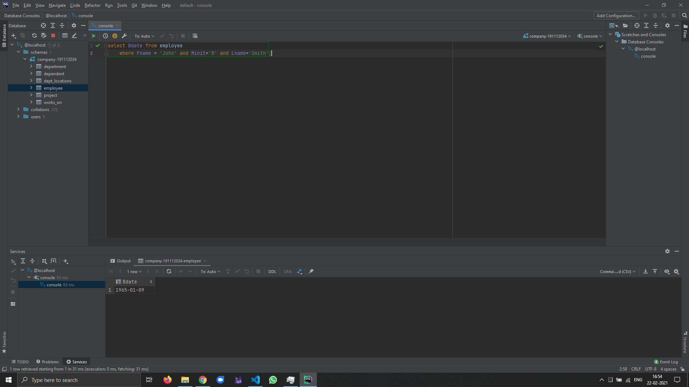
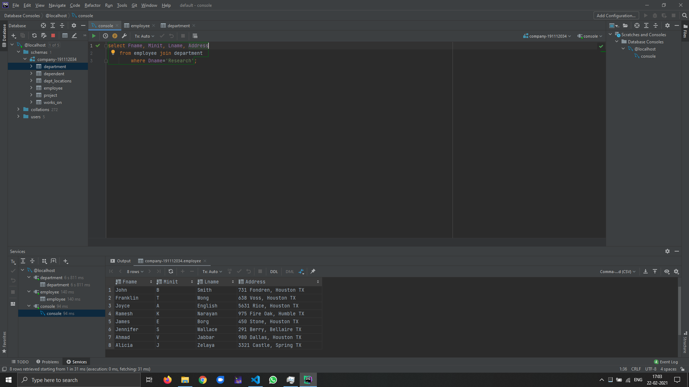
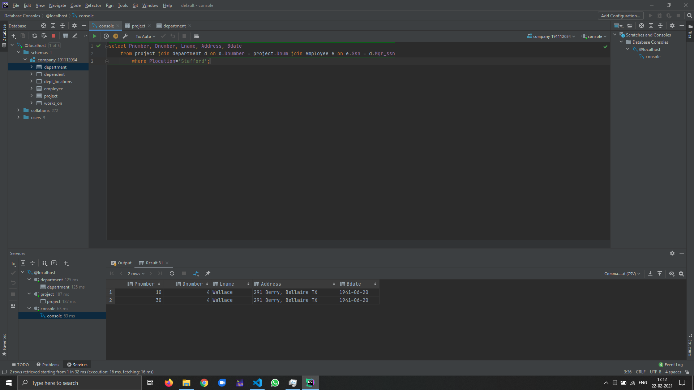
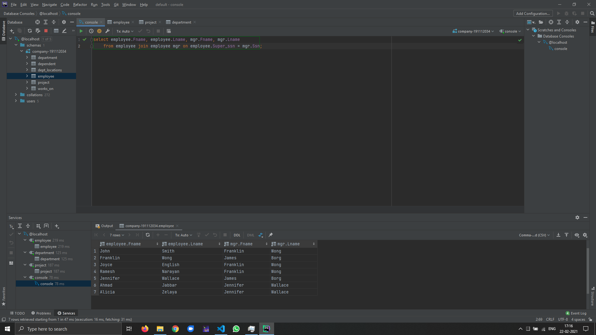
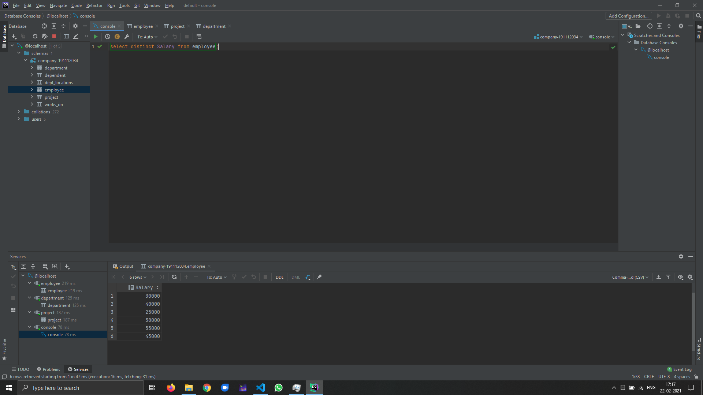
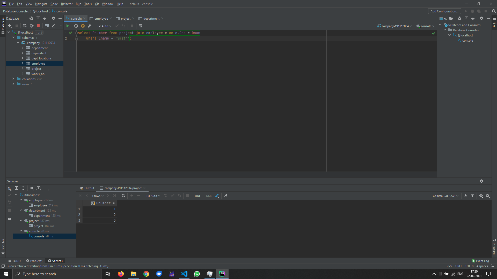
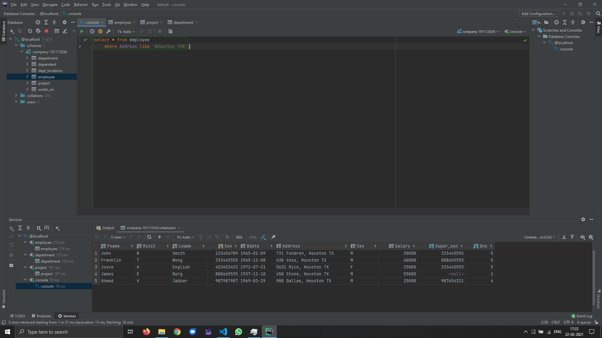
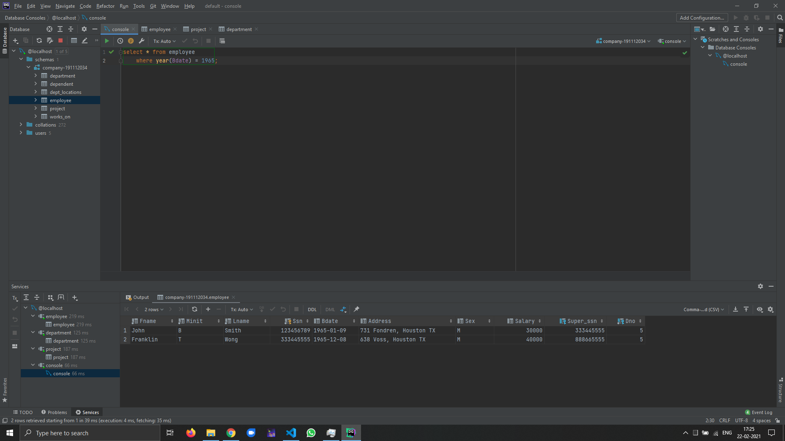
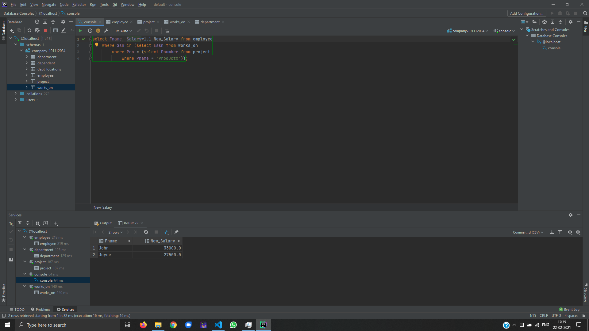
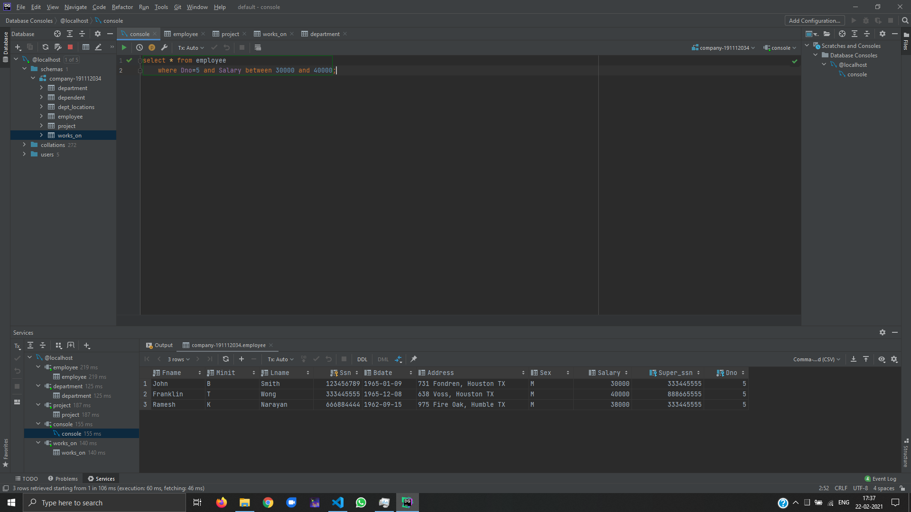

\newpage

# 1. Query 1
Retrieve the birth date and address of the employee(s) whose name is ‘John B. Smith’. 

## 1.1. Source Code
```sql
select Bdate from employee
    where Fname = 'John' and Minit='B' and Lname='Smith';
```

## 1.2. Output


---

\newpage
 
# 2. Query 2
Retrieve the name and address of all employees who work for the ‘Research’ department. 

## 2.1. Source Code
```sql
select Fname, Minit, Lname, Address
    from employee join department
        where Dname='Research';
```

## 2.2. Output


---

\newpage
 
# 3. Query 3
For every project located in ‘Stafford’, list the project number, the controlling department number, and the department manager’s last name, address, and birth date.	 

## 3.1. Source Code
```sql
select Pnumber, Dnumber, Lname, Address, Bdate
    from project join department d on d.Dnumber = project.Dnum join employee e on e.Ssn = d.Mgr_ssn
        where Plocation='Stafford';
```

## 3.2. Output


---

\newpage
 
# 4. Query 4
For each employee, retrieve the employee’s first and last name and the first and last name of his or her immediate supervisor. 

## 4.1. Source Code
```sql
select employee.Fname, employee.Lname, mgr.Fname, mgr.Lname
    from employee join employee mgr on employee.Super_ssn = mgr.Ssn;
```

## 4.2. Output


---

\newpage
 
# 5. Query 5
Retrieve the salary of every employee and all distinct salary values 

## 5.1. Source Code
```sql
select distinct Salary from employee;
```

## 5.2. Output


---

\newpage
 
# 6. Query 6
Make a list of all project numbers for projects that involve an employee whose last name is ‘Smith’, either as a worker or as a manager of the department that controls the project. 

## 6.1. Source Code
```sql
select Pnumber from project join employee e on e.Dno = Dnum
    where Lname = 'Smith';
```

## 6.2. Output


---

\newpage
 
# 7. Query 7
Retrieve all employees whose address is in Houston, Texas. 

## 7.1. Source Code
```sql
select * from employee
    where Address like '%Houston TX%';
```

## 7.2. Output


---

\newpage
 
# 8. Query 8
Find all employees who were born in 1965s. 

## 8.1. Source Code
```sql
select * from employee
    where year(Bdate) = 1965;
```

## 8.2. Output


---

\newpage
 
# 9. Query 9
Show the resulting salaries if every employee working on the ‘ProductX’ project is given a 10% raise. 

## 9.1. Source Code
```sql
select Fname, Salary*1.1 New_Salary from employee
    where Ssn in (select Essn from works_on
        where Pno = (select Pnumber from project
            where Pname = 'ProductX'));
```

## 9.2. Output


---

\newpage
 
# 10. Query 10
Retrieve all employees in department 5 whose salary is between $30,000 and $40,000. 

## 10.1. Source Code
```sql
select * from employee
    where Dno=5 and Salary between 30000 and 40000;
```

## 10.2. Output


---