\newpage
 
# 1. Query 1
Find employees who work in Department 5 for more than 5 hours on 'Product X'

## 1.1. Source Code
```sql
select Fname,Minit,LName from employee,works_on,project
    where Ssn=Essn and Pno=Pnumber and Dno=5 and hours>=10 and Pname='ProductX';
```

## 1.2. Output
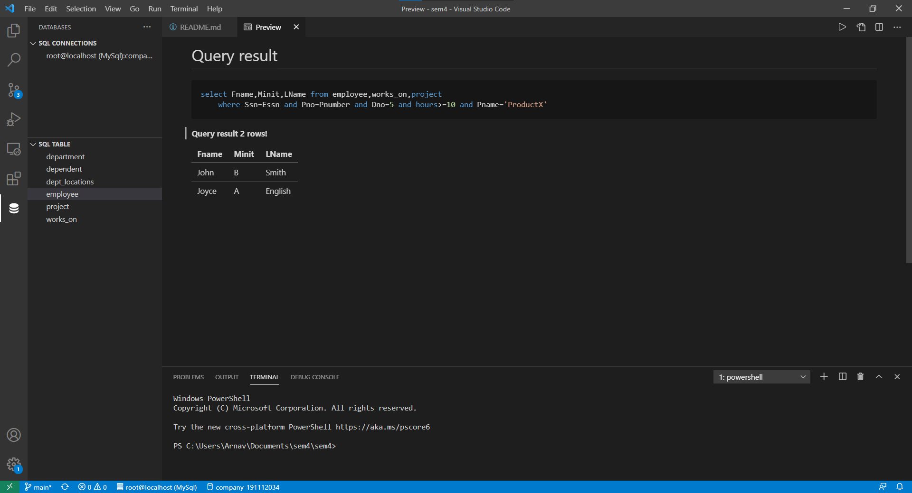

---

\newpage
 
# 2. Query 2
Find Dependents who have same first name as employees.

## 2.1. Source Code
```sql
select Fname,Minit,Lname from employee, dependent
    where Ssn=Essn and Fname=Dependent_name;
```

## 2.2. Output
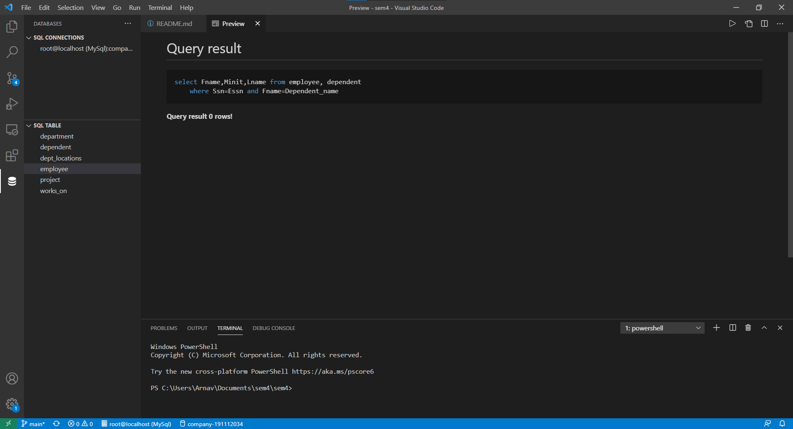

---

\newpage
 
# 3. Query 3
Find employees whose supervisor is 'Franklin Wong'

## 3.1. Source Code
```sql
select E1.Fname,E1.Lname from Employee E1,Employee E2
    where E1.Super_ssn=E2.Ssn and E2.Fname='Franklin' and E2.Lname='Wong';
```

## 3.2. Output
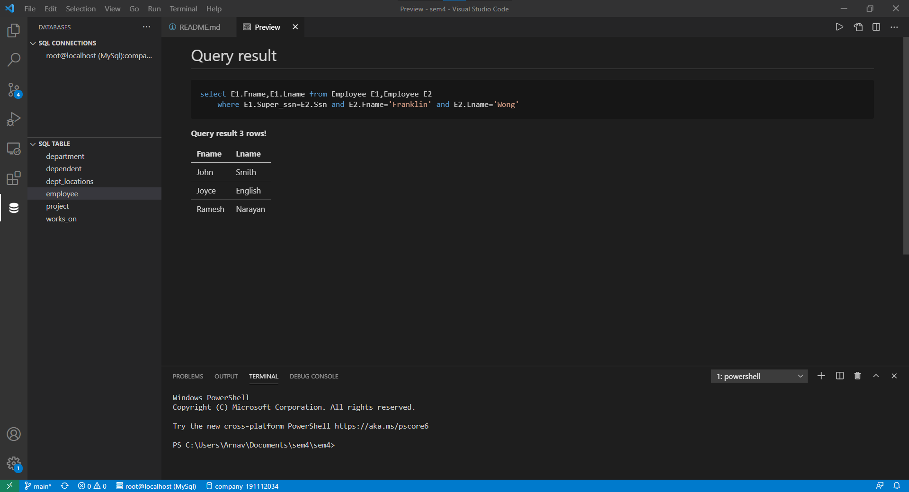

---

\newpage
 
# 4. Query 4
Find total hours worked on each project

## 4.1. Source Code
```sql
select Pname,sum(hours) from (Project join works_on on Pnumber=Pno)
    group by Pname;
```

## 4.2. Output
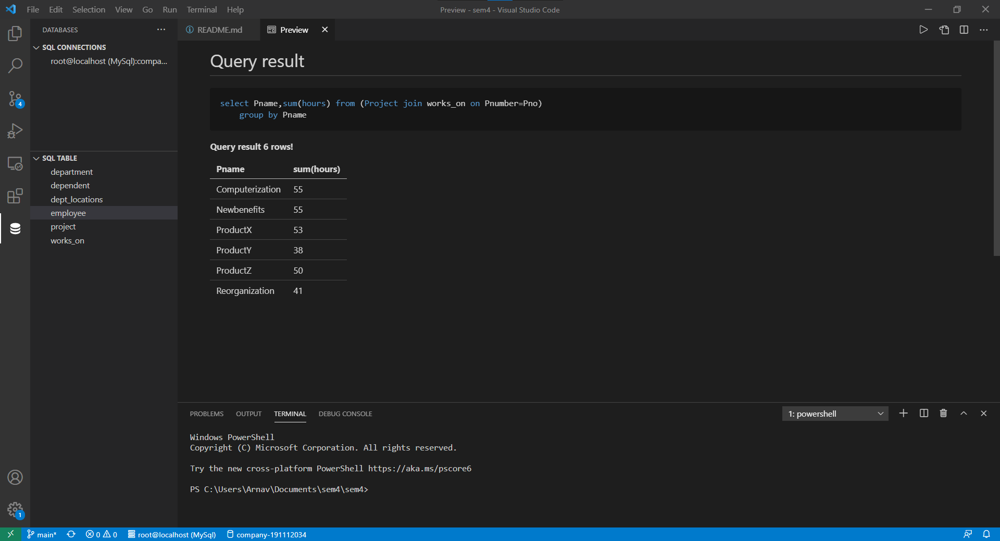

---

\newpage
 
# 5. Query 5
Find employees who work on every project

## 5.1. Source Code
```sql
select Fname, Minit, Lname from employee
    where not exists
        (select Pnumber from project where not exists
            (select Pno from works_on where Pnumber=Pno and Essn=Ssn));
```

## 5.2. Output
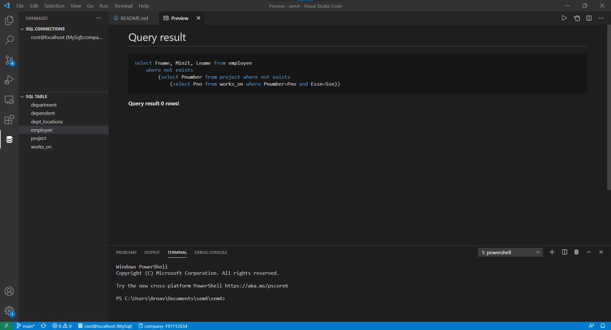

---

\newpage
 
# 6. Query 6
Find employees who do not work on any project

## 6.1. Source Code
```sql
select fname,minit,lname from employee
    where not exists
        (select essn from works_on where ssn = essn);
```

## 6.2. Output
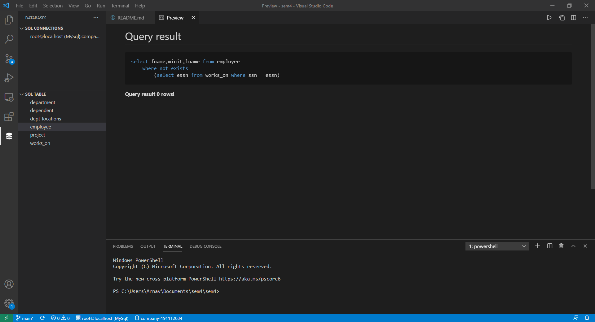

---

\newpage
 
# 7. Query 7
Find average salary of employees by department

## 7.1. Source Code
```sql
Select Dname,avg(salary) from employee,department
    where Dno=Dnumber group by Dname;
```

## 7.2. Output
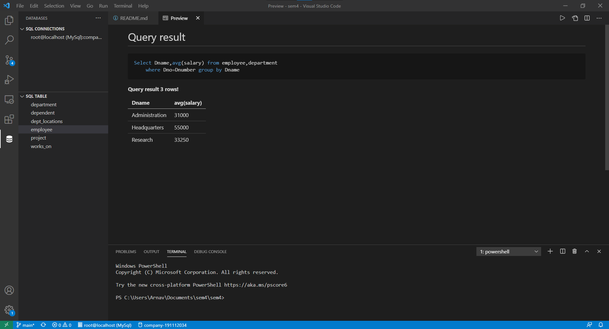

---

\newpage
 
# 8. Query 8
Find name and address of all employees who work on at least one project located in Houston but whose department has no location in Houston

## 8.1. Source Code
```sql
Select Fname, Minit, Lname, Address from (employee join works_on on Ssn=Essn)
    where Pno in (Select Pnumber from project where Plocation='Houston') and
        Dno not in (Select Dnumber from dept_locations where Dlocation='Houston');
```

## 8.2. Output
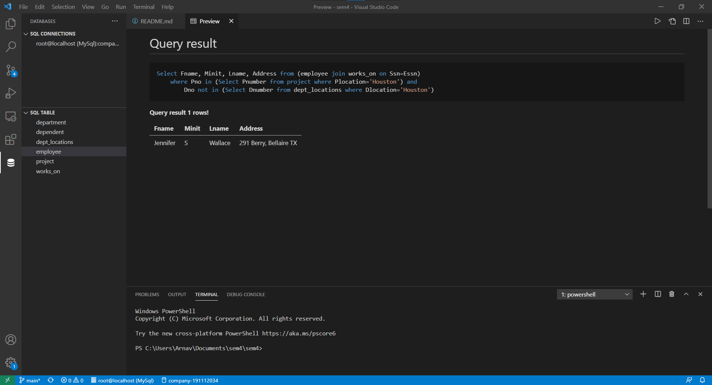

---

\newpage
 
# 9. Query 9
Find last name of all department managers who have no dependents

## 9.1. Source Code
```sql
Select Lname from employee,department
    where Ssn = Mgr_ssn and not exists (select dependent_name from dependent where Mgr_ssn=Ssn);
```

## 9.2. Output
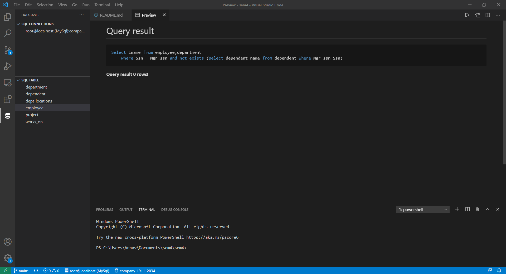

---

\newpage
 
# 10. Query 10
Find the number of employee in each department whose average department employee salary is more than $8000.

## 10.1. Source Code
```sql
select Dname,count(Ssn) from employee,department
    where Dno=Dnumber group by Dname having avg(Salary)>=80000;
```

## 10.2. Output
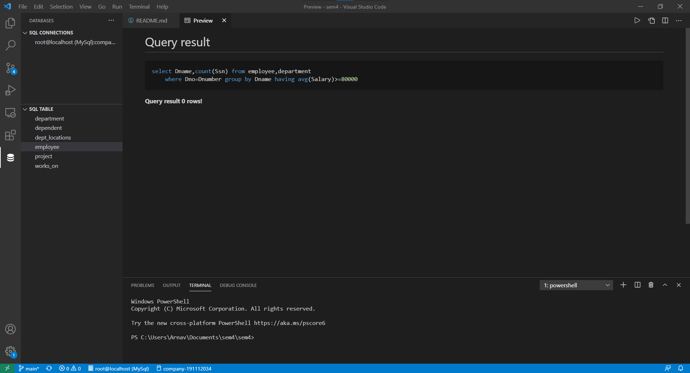

---

\newpage
 
# 11. Query 11
Find projects which involve employee with last name 'Smith' either as worker or as manager of the department that controls the project

## 11.1. Source Code
```sql
select distinct Pno from employee, works_on
    where Ssn=Essn and Lname='Smith'
    union
    select distinct Pnumber from employee,project,department
        where Dnum=Dnumber and Mgr_ssn=Ssn and Lname='Smith';
```

## 11.2. Output
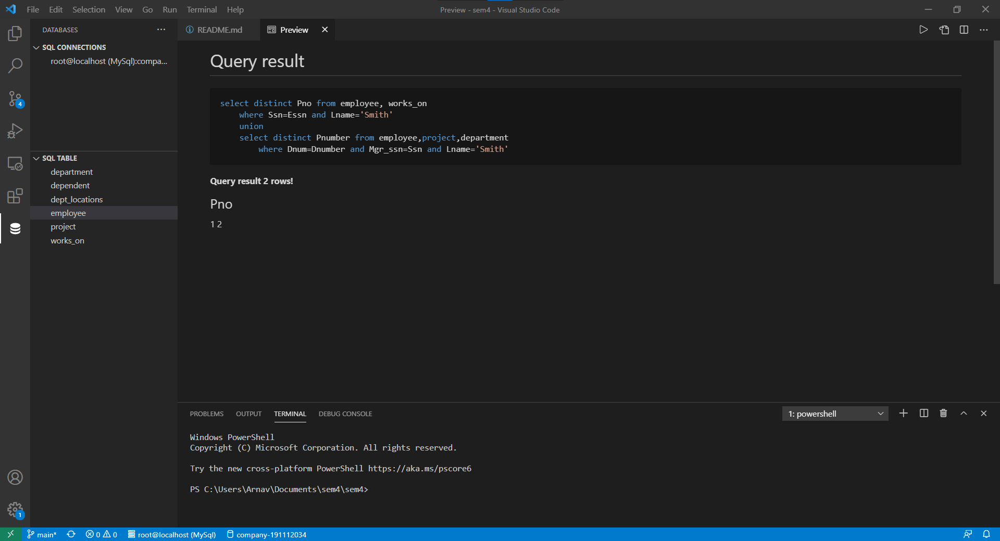

---

\newpage
 
# 12. Query 12
Find employees who work on more than two projects

## 12.1. Source Code
```sql
select distinct Lname,Fname from employee E, works_on W1, works_on W2
    where W1.Essn=E.Ssn and W2.Essn=E.Ssn and W1.Pno <> W2.Pno;
```

## 12.2. Output
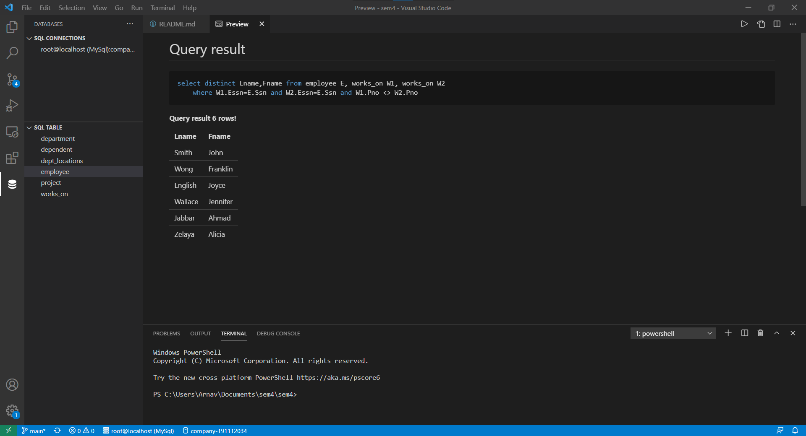

---

\newpage
 
# 13. Query 13
Find total hours worked on each project

## 13.1. Source Code
```sql
select E1.Fname,E1.Lname from Employee E1
    where E1.salary > (select avg(E2.salary) from employee E2 where E1.Dno=E2.Dno);
```

## 13.2. Output
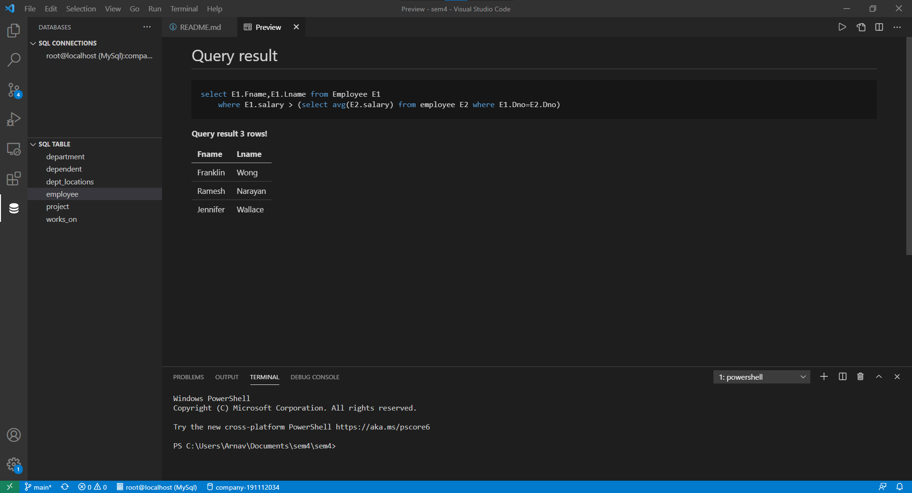

---
