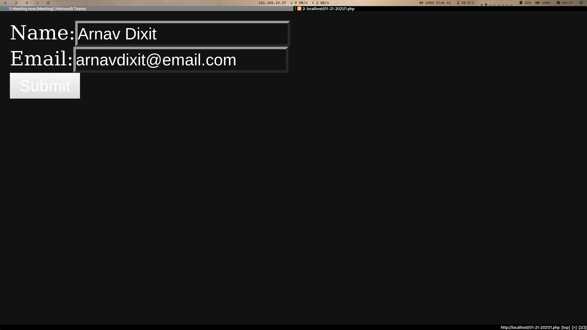

# Table of Contents <!-- omit in toc -->

- [1. PHP Form](#1-php-form)
  - [1.1. Input Form](#11-input-form)
    - [1.1.1. Source Code](#111-source-code)
    - [1.1.2. Output](#112-output)
  - [1.2. Welcome Message](#12-welcome-message)
    - [1.2.1. Source Code](#121-source-code)
    - [1.2.2. Output](#122-output)

# 1. PHP Form
Create a form in PHP to input the Name and Email of the user and greet him with a personalised welcome message.

## 1.1. Input Form
A simple form to input the Name and Email of the user.

### 1.1.1. Source Code
```php
<html>
    <body>
        <form action="2.php" method='post'>
            Name:  <input type="text" name="username"><br>
            Email: <input type="text" name='email'><br>
            <input type="Submit" value='Submit'>
        </form>
    </body>
</html>

```

### 1.1.2. Output


---

## 1.2. Welcome Message
Welcome message printed with the username from the pervios form.

### 1.2.1. Source Code
```php
<?php
    echo "Hello ", $_POST["username"];
?>
```

### 1.2.2. Output


---
