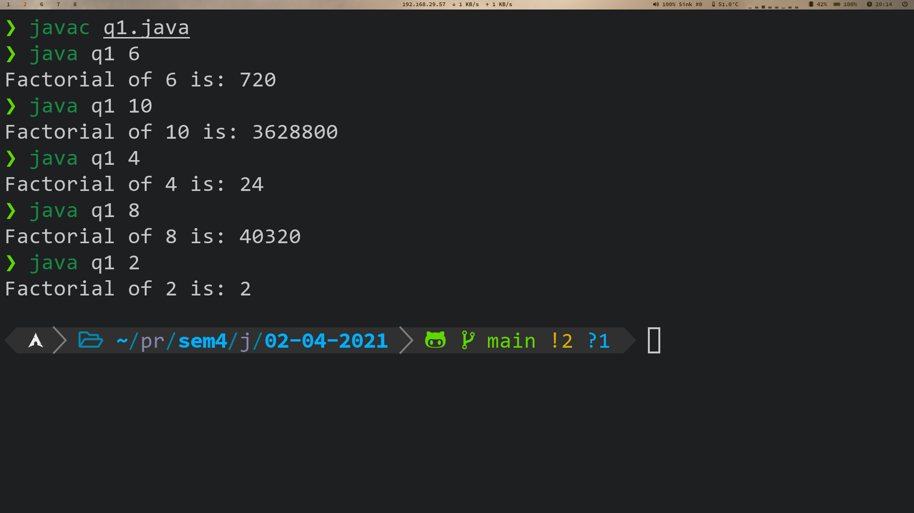
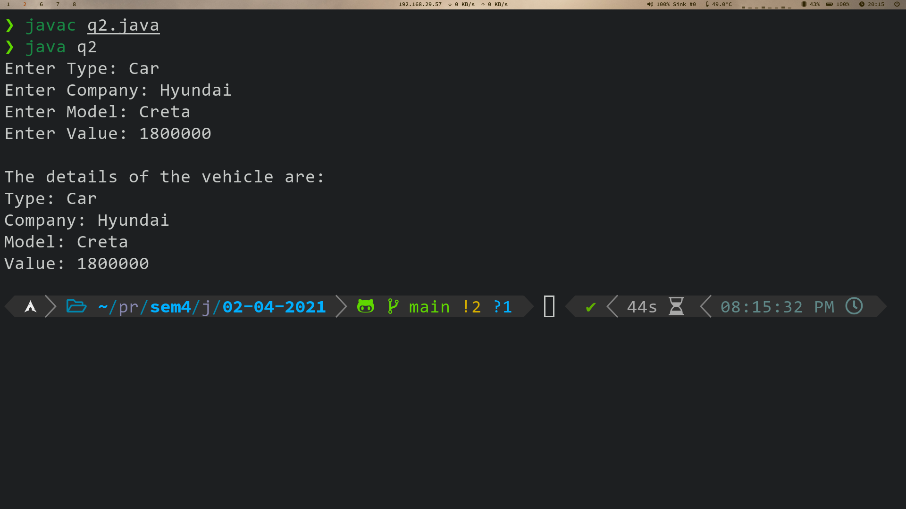
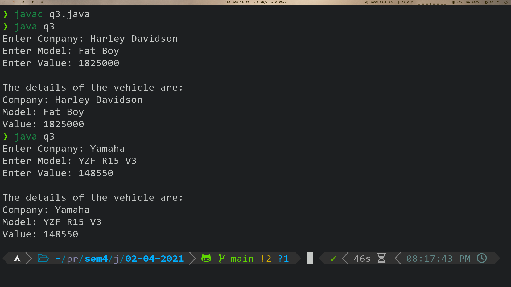
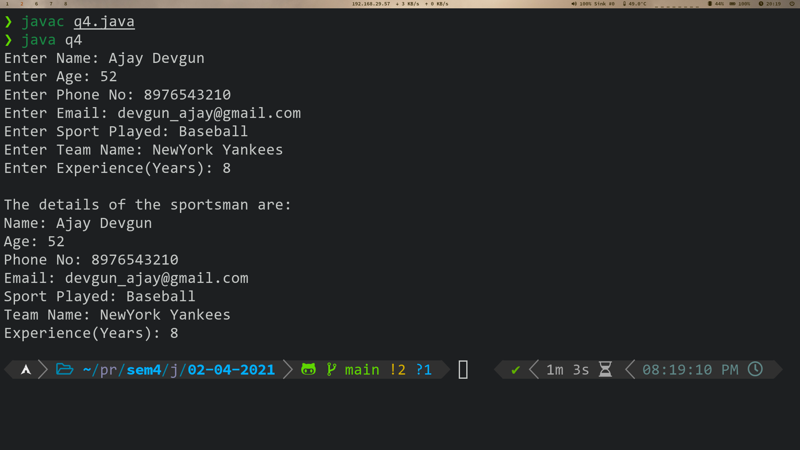
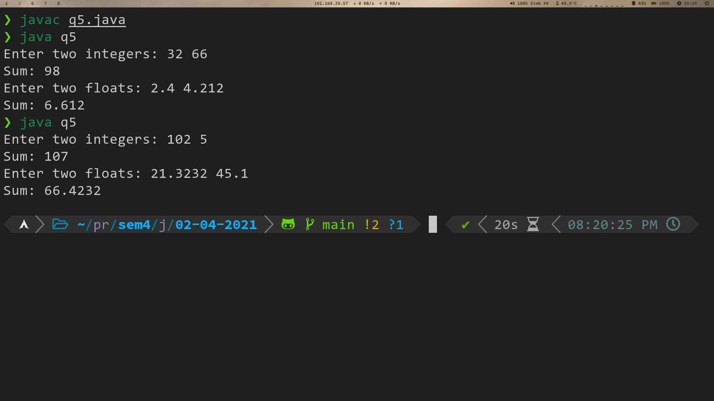

# Table of Contents <!-- omit in toc -->

- [1. Command line arguments](#1-command-line-arguments)
  - [1.1. Source Code](#11-source-code)
  - [1.2. Output](#12-output)
- [2. Constructors](#2-constructors)
  - [2.1. Source Code](#21-source-code)
  - [2.2. Output](#22-output)
- [3. Interface](#3-interface)
  - [3.1. Source Code](#31-source-code)
  - [3.2. Output](#32-output)
- [4. Inheritance](#4-inheritance)
  - [4.1. Source Code](#41-source-code)
  - [4.2. Output](#42-output)
- [5. Overloading](#5-overloading)
  - [5.1. Source Code](#51-source-code)
  - [5.2. Output](#52-output)

# 1. Command line arguments 
Write a JAVA program to calculate the factorial of a number, input should be given though the command line argument. 

## 1.1. Source Code
```java

class q1 {  
    public static void main(String args[]){  
        int i,fact=1;  
        int num = Integer.parseInt(args[0]);
        for(i=1;i<=num;i++) {    
            fact=fact*i;    
        }    
        System.out.println("Factorial of "+ num +" is: "+fact);    
    }  
}  
```

## 1.2. Output


---

# 2. Constructors
Write a JAVA program to initialize and display the attribute values of a class “vehicle” variables using constructor. 

## 2.1. Source Code
```java
import java.util.Scanner;  

class vehicle {
    private String type, company, model;
    private int value;

    public vehicle(String t, String c, String m, int v) {
        type = t;
        company = c;
        model = m;
        value = v;
    }
    public void display() {
        System.out.println("Type: " + type);
        System.out.println("Company: " + company);
        System.out.println("Model: " + model);
        System.out.println("Value: " + value);
    }
}

class q2 {
    public static void main(String args[]) {

        Scanner in = new Scanner(System.in);  

        System.out.print("Enter Type: ");
        String t = in.nextLine();
        System.out.print("Enter Company: ");
        String c = in.nextLine();
        System.out.print("Enter Model: ");
        String m = in.nextLine();
        System.out.print("Enter Value: ");
        int v = in.nextInt();

        vehicle veh = new vehicle(t, c, m, v);
        System.out.println("\nThe details of the vehicle are: ");
        veh.display();
    }
}
```

## 2.2. Output


---

# 3. Interface
Create an interface ‘vehicle’ and implement the methods of the interface in class ‘bike’ to get and display the attribute values. 

## 3.1. Source Code
```java
import java.util.Scanner;  

interface vehicle {
    
    void input();
    void display();
}

class bike implements vehicle {
    private String company, model;
    private int value;
    public void input() {        
        Scanner in = new Scanner(System.in);  

        System.out.print("Enter Company: ");
        company = in.nextLine();
        System.out.print("Enter Model: ");
        model = in.nextLine();
        System.out.print("Enter Value: ");
        value = in.nextInt();
    }
    public void display() {
        System.out.println("Company: " + company);
        System.out.println("Model: " + model);
        System.out.println("Value: " + value);
    }
}

class q3 {
    public static void main(String args[]) {

        bike b1 = new bike();
        b1.input();
        System.out.println("\nThe details of the vehicle are: ");
        b1.display();
    }
}
```

## 3.2. Output


---

# 4. Inheritance
Write a JAVA program, in which create a sportsman class that inherits the class person to initialize the basic attributes of a sportsman object. 

## 4.1. Source Code
```java
import java.util.Scanner;

class person {
    public String name;
    protected String email;
    public int age;
    protected int height, weight;
    protected long phone;
}

class sportsman extends person {
    public String sport, team;
    public int experience;

    public void input() {
        Scanner in = new Scanner(System.in);
        System.out.print("Enter Name: ");
        name = in.nextLine();
        System.out.print("Enter Age: ");
        age = in.nextInt();
        System.out.print("Enter Phone No: ");
        phone = in.nextLong();
        in.nextLine();
        System.out.print("Enter Email: ");
        email = in.nextLine();

        System.out.print("Enter Sport Played: ");
        sport = in.nextLine();
        System.out.print("Enter Team Name: ");
        team = in.nextLine();
        System.out.print("Enter Experience(Years): ");
        experience = in.nextInt();
    }

    public void display() {
        System.out.println("Name: " + name);
        System.out.println("Age: " + age);
        System.out.println("Phone No: " + phone);
        System.out.println("Email: " + email);
        System.out.println("Sport Played: " + sport);
        System.out.println("Team Name: "  + team);
        System.out.println("Experience(Years): " + experience);
    }
}

class q4 {
    public static void main(String args[]) {
        sportsman sp = new sportsman();
        
        sp.input();
        System.out.println("\nThe details of the sportsman are:");
        sp.display();
    }
}
```

## 4.2. Output


---

# 5. Overloading
Create a JAVA program to perform method overloading to perform addition of float and integer numbers.  

## 5.1. Source Code
```java
import java.util.Scanner;

class adder {
    static int add(int x, int y)
    {
        return x + y;
    }
    static float add(float a, float b)
    {
        return a + b;
    }
}

class q5 {


    public static void main(String args[])
    {
        Scanner in = new Scanner(System.in);
        int x, y;
        float a, b;
        System.out.print("Enter two integers: ");
        x = in.nextInt();
        y = in.nextInt();
        System.out.println("Sum: " + adder.add(x, y));

        System.out.print("Enter two floats: ");
        a = in.nextFloat();
        b = in.nextFloat();
        System.out.println("Sum: " + adder.add(a, b));
        
    }
}
```

## 5.2. Output


---