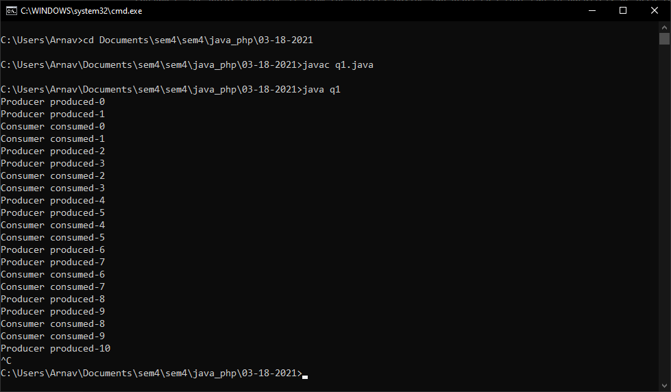

# Producer Consumer Problem
There are two processes, a producer and a consumer, that share a common buffer with a limited size. The producer “produces” data and stores it in the buffer, and the consumer “consumes” the data, removing it from the buffer. Having two processes that run in parallel, we need to make sure that the producer will not put new data in the buffer when the buffer is full and the consumer won’t try to remove data from the buffer if the buffer is empty.

## Source Code
```java
import java.util.LinkedList; 
  
public class q1 
{ 
    public static void main(String[] args) throws InterruptedException 
    { 
        final PC pc = new PC(); 
  
        Thread t1 = new Thread(new Runnable() 
        { 
            public void run() 
            { 
                try
                { 
                    pc.produce(); 
                } 
                catch(InterruptedException e) 
                { 
                    e.printStackTrace(); 
                } 
            } 
        }); 
  
        Thread t2 = new Thread(new Runnable() 
        { 
            public void run() 
            { 
                try
                { 
                    pc.consume(); 
                } 
                catch(InterruptedException e) 
                { 
                    e.printStackTrace(); 
                } 
            } 
        }); 
  
        t1.start(); 
        t2.start(); 
  
        t1.join(); 
        t2.join(); 
    } 
  
    public static class PC 
    { 
        LinkedList<Integer> list = new LinkedList<>(); 
        int capacity = 2; 
  
        public void produce() throws InterruptedException 
        { 
            int value = 0; 
            while (true) 
            { 
                synchronized (this) 
                { 
                    while (list.size()==capacity) 
                        wait(); 
  
                    System.out.println("Producer produced-"+ value); 
  
                    list.add(value++); 
  
                    notify(); 
  
                    Thread.sleep(1000); 
                } 
            } 
        } 
  
        public void consume() throws InterruptedException 
        { 
            while (true) 
            { 
                synchronized (this) 
                { 
                    while (list.size()==0) 
                        wait(); 
  
                    int val = list.removeFirst(); 
  
                    System.out.println("Consumer consumed-"+ val); 
  
                    notify(); 
  
                    Thread.sleep(1000); 
                } 
            } 
        } 
    } 
} 
```

## Output


---