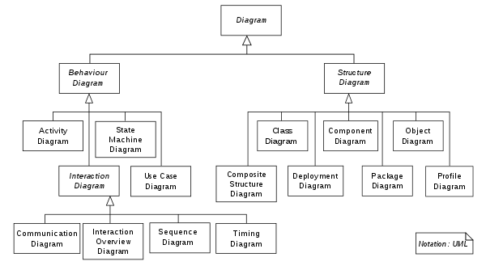

\tableofcontents
\newpage
# Unified Modelling Language(UML)
The Unified Modeling Language (UML) is a general-purpose, developmental, modeling language in the field of software engineering that is intended to provide a standard way to visualize the design of a system[@booch2009unified].  

UML 2 has many types of diagrams, which are divided into two categories. Some types represent structural information, and the rest represent general types of behavior, including a few that represent different aspects of interactions[@specification2007omg]. These diagrams can be categorized hierarchically as shown in [@fig:uml]  

{#fig:uml}

These diagrams csn be categorised into two types[@wikipedia] Behaviour Diagram and Structure Diagram. 

# Behaviour Diagrams:
They are used to represent the dynamic aspect of the system. It shows what must happen in the system being modeled. They are used widely to describe the functionality of software systems. 
Behaviour Diagrams are further divided as:  
1. Activity Diagram  
2. Communication Diagram  
3. Interaction Overview Diagram  
4. Sequence Diagram  
5. State Diagram  
6. Timing Diagram  
7. Use case Diagram  

## Activity Diagram:
Action diagrams are graphical portrayals of work processes of stepwise exercises and actions with help for decision, cycle and simultaneousness[@glossarykeyterms]. In UML, action outlines are planned to demonstrate both computational and hierarchical cycles, just as the information streams converging with the related activities[@force2001omg][@booch1999unified]. 

## Communication Diagram:
A Communication diagram models the interactions between objects or parts in terms of sequenced messages[@fowler2004uml]. Communication diagrams represent a combination of information taken from Class, Sequence, and Use Case Diagrams describing both the static structure and dynamic behavior of a system.

## Interaction Overview Diagram
The interaction overview diagram is similar to the activity diagram, in that both visualize a sequence of activities. The difference is that, for an interaction overview, each  individual activity is pictured as a frame which can contain a nested interaction diagram[@altova_uml_2021]. This makes the interaction overview diagram useful to "deconstruct a complex scenario that would otherwise require multiple if-then-else paths to be illustrated as a single sequence diagram"[@fowler2004uml].

## Sequence Diagram
A sequence diagram shows object interactions arranged in time sequence. It depicts the objects involved in the scenario and the sequence of messages exchanged between the objects needed to carry out the functionality of the scenario[@force2001omg]. 

## State Diagram
In UML, states are represented as rounded rectangles labeled with state names. The transitions, represented as arrows, are labeled with the triggering events followed optionally by the list of executed actions[@force2001omg]. 

## Timing Diagram
Timing diagrams are used to explore the behaviors of objects throughout a given period of time. A timing diagram is a special form of a sequence diagram[@force2001omg]. The differences between timing diagram and sequence diagram are the axes are reversed so that the time increases from left to right and the lifelines are shown in separate compartments arranged vertically.

## Use Case Diagram
A use case diagram at its simplest is a representation of a user's interaction with the system that shows the relationship between the user and the different use cases in which the user is involved. A use case diagram can identify the different[@wikipedia] types of users of a system and the different use cases and will often be accompanied by other types of diagrams as well.

# Structure Diagrams:
Structure diagrams represents the static aspects of the system. It emphasize the things that must be present in the system being modeled. They are used extensively in documenting the software architecture of software systems. 

Structural Diagram types:  
1. Class Diagram  
2. Component Diagram  
3. Composite structure Diagram  
4. Deployment Diagram  
5. Object Diagram  
6. Package Diagram  
7. Profile Diagram  

## Class Diagram
The class diagram is the main building block of object-oriented modeling. It is used for general conceptual modeling of the structure of the application, and for detailed modeling translating the models into programming code. Class diagrams can also be used for data modeling.

## Component Diagram
A component diagram depicts how components are wired together to form larger components or software systems. They are used to illustrate the structure of arbitrarily complex systems[@bell2004uml].

## Composite Structure Diagram
It shows the internal structure of a class and the collaborations that this structure makes possible. A composite structure is a set of interconnected elements that collaborate at runtime to achieve some purpose. Each element has some defined[@wikipedia] role in the collaboration.

## Deployment Diagram
A deployment diagram models the physical deployment of artifacts on nodes[@specification2007omg]. A deployment diagram would show what hardware components exist, what software components run on each node, and how the different pieces are connected together.

## Object Diagram
An object diagram shows a complete or partial view of the structure of a modeled system at a specific time. The use of object diagrams is fairly limited, namely to show examples of data structure. 

## Package Diagram
A package diagram depicts the dependencies between the packages that make up a model. There are two special types of dependencies defined between packages, package import and package merge. A package import is a relationship between an importing namespace and a package, indicating that the importing namespace adds the names of the members of the package to its own namespace[@specification2007omg]. A package merge is a directed relationship between two packages, that indicates that the contents of the two packages are to be combined[@specification2007omg].

## Profile Diagram
A profile diagram operates at the metamodel level to show stereotypes as classes and profiles as packages. The extension relation indicates what metamodel element a given stereotype is extending[@fontoura2002uml].

# References

---
nocite: '@*'
---